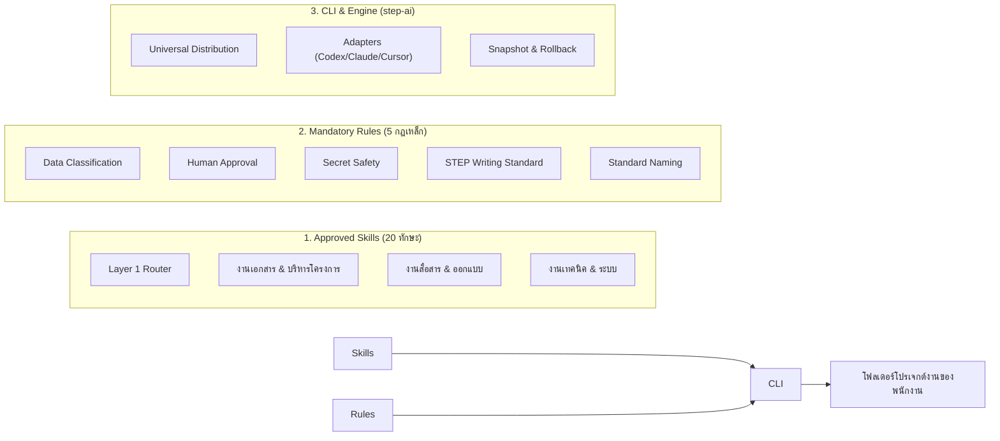
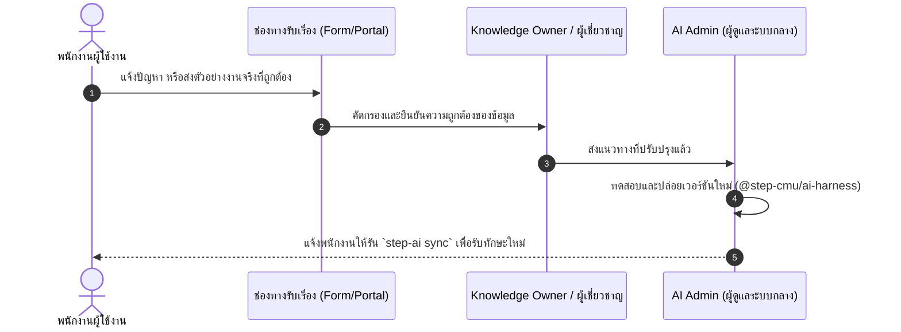

# STeP AI Harness 🚀
### ระบบกำกับดูแลและกระจาย AI Skills & Rules ระดับองค์กร
**อุทยานวิทยาศาสตร์และเทคโนโลยี มหาวิทยาลัยเชียงใหม่ (STeP / RSP North)**

---

**STeP AI Harness** คือคลังต้นแบบภายในสำหรับนำความรู้ขององค์กร มาตรฐานการทำงาน และขั้นตอนที่ใช้ซ้ำได้มาใช้ร่วมกันในบุคลากรทั้ง **22 ทีม (5 กลุ่มงาน)** ของอุทยานฯ เพื่อให้สามารถใช้งาน AI Agents (เช่น **OpenAI Codex**, **Claude Code**, **Cursor IDE**) ได้อย่างมีประสิทธิภาพ ปลอดภัย และถูกต้องตามระเบียบของมหาวิทยาลัยเชียงใหม่และหน่วยงานราชการ

> [!NOTE]
> **นโยบายระยะทดลอง (Universal Access Model & 22-Team Routing):**  
> • **พนักงานทั่วไป:** ดาวน์โหลดแล้วดับเบิลคลิกติดตั้งได้ทันที ไม่ต้องรู้เรื่อง Git, Node หรือคำสั่ง Terminal  
> • **การเข้าถึง:** พนักงานทุกคนสามารถเข้าถึงและใช้งาน Approved Skills ได้อย่างยืดหยุ่น โดยมี **Layer 1 Router** คอยคัดเลือกทักษะที่ถูกต้องให้อัตโนมัติตามบริบทงาน

---

## 🚀 เริ่มต้นใช้งานฉบับพนักงานทั่วไป (Zero-Terminal / No Code)

> **เป้าหมาย:** ดาวน์โหลด → ดับเบิลคลิกติดตั้ง → เลือกทีม → พร้อมใช้งานทันที

1. **ดาวน์โหลด:** นำไฟล์ `STeP-AI-Pilot-v0.1.0.zip` จาก Shared Drive ขององค์กรมาไว้ในเครื่อง แล้วคลิกขวาเลือก *Extract All...* (แตกไฟล์)
2. **ดับเบิลคลิกติดตั้ง:** ดับเบิลคลิกที่ไฟล์ **`Install-STeP-AI.bat`**
   - ระบบจะตรวจหาโปรแกรม AI (Codex/VS Code, Cursor, Claude) ในเครื่องให้อัตโนมัติ
   - กดเลือกหมายเลขทีมของคุณ (เช่น `1. QS`, `2. AFP`, `3. CC`, `4. MI`, `5. PITI` หรือพิมพ์ `A` เพื่อดูครบ 22 ทีม)
3. **เสร็จสิ้นพร้อมใช้งาน:** ระบบจะแจ้งเตือน `✓ STeP AI พร้อมใช้งาน`
   - เปิดโปรแกรม AI ที่คุณใช้ แล้วพิมพ์ถามงานภาษาไทยธรรมดาได้ทันที เช่น:
     - *"ช่วยตรวจ TOR จัดซื้อระบบ หน่อยครับ"*
     - *"ช่วยทำบรีฟออกแบบโปสเตอร์งานแถลงข่าว"*
     - *"ช่วยตรวจใบเสร็จรับเงินฉบับนี้ก่อนส่งเบิก"*
   - เมื่อองค์กรมีอัปเดตใหม่ เพียงดับเบิลคลิก **`Update-STeP-AI.bat`**
   - อ่านคู่มือพนักงานฉบับเต็มได้ที่ [docs/employee-guide.md](docs/employee-guide.md)

---

## 💻 สำหรับ Developer และผู้ใช้งาน Command Line

```bash
# 1. ถามงานภาษาไทยธรรมดา เพื่อให้ AI วิเคราะห์ Skill, SOP และระเบียบที่เกี่ยวข้อง
step-ai ask "ช่วยตรวจ TOR ฉบับนี้หน่อย"
step-ai ask "ช่วยตรวจใบเสร็จนี้ว่าเบิกจ่ายตามระเบียบ มช. ได้มั้ย"

# 2. ดูหรือเปลี่ยนทีมหลักประจำตัว (บันทึกไว้ใน ~/.step-ai/config.json)
step-ai config
step-ai config --team qs

# 3. อัปเดตทักษะและ Router ล่าสุดในคลิกเดียว (รักษาคอนฟิกผู้ใช้เดิม)
step-ai update

# 4. ติดตั้ง Skills เข้า Workspace ตามทีม หรือแบบ Universal Access (All)
step-ai init --team qs --tool codex
step-ai init --role all --tool claude

# 5. ตรวจความพร้อมของระบบในโหมดพนักงาน
step-ai doctor --employee

# 6. ดูผัง 22 ทีม และ 5 Domain Clusters
step-ai teams
```

---

## 🏛️ สถาปัตยกรรม 3 ชั้น (3-Layer Architecture with Progressive Disclosure)

```text
User Request / step-ai ask
         ↓
┌─────────────────────────────────────────────────────────────┐
│ Layer 1: STeP Skill Router                                  │
│ - สแกนบริบทราคาถูก (โฟลเดอร์, นามสกุลไฟล์, เจตนาภาษาไทย)   │
│ - คัดกรองและนำทางตรงสู่ 22 ทีม และ 5 Domain Clusters        │
│ - คำนวณความตรงกันด้วย 5-Factor Deterministic Scoring        │
└─────────────────────────────────────────────────────────────┘
         ↓
┌─────────────────────────────────────────────────────────────┐
│ Layer 2: Targeted Domain Skill                              │
│ - โหลดเฉพาะ SKILL.md เดียวที่เกี่ยวข้อง (Installed ≠ Loaded) │
│ - กำกับด้วย 3-Outcome Scope Guard (ALLOW / ESCALATE / BLOCK)│
└─────────────────────────────────────────────────────────────┘
         ↓
┌─────────────────────────────────────────────────────────────┐
│ Layer 3: Lazy References                                    │
│ - เปิดอ่าน Rules, SOPs, Templates เฉพาะเมื่อจำเป็น          │
└─────────────────────────────────────────────────────────────┘
```

---

## 🏢 ผัง 22 ทีมของ STeP (5 Domain Clusters)

ระบบรองรับการทำงานของ **22 ทีม** ภายใต้อุทยานวิทยาศาสตร์และเทคโนโลยี มหาวิทยาลัยเชียงใหม่ (STeP / RSP North) จัดหมวดหมู่เป็น 5 กลุ่มงานหลัก (อ่านฉบับเต็มได้ที่ [docs/teams.md](docs/teams.md)):

1. **Governance, Operations & Quality (6 ทีม):** `GA` (บริหารทั่วไป), `AFP` (การเงิน/จัดซื้อ/TOR), `IASA` (ความร่วมมือสากล), `QS` (ระบบคุณภาพ ISO), `NMCO` (เครือข่าย อว.), `HD` (พัฒนาบุคลากร)
2. **Incubation, Entrepreneurship & Strategy (5 ทีม):** `PITI` (บ่มเพาะเทคโนโลยี), `ISI` (บ่มเพาะ Startup), `EIC` (พัฒนาผู้ประกอบการ), `IMO` (บริหารนวัตกรรม), `SIT` (ยุทธศาสตร์และการเปลี่ยนแปลง)
3. **Tech Transfer & Industry Collaboration (4 ทีม):** `Tech Spin` (Spin-off/สิทธิบัตร), `Tech Up` (ขยายขนาด Deep Tech), `LINC` (เชื่อมโยงชุมชนและโรงงาน), `PubSec` (โครงการภาครัฐ)
4. **Market, Creative & Client (3 ทีม):** `CC` (งานสร้างสรรค์/Brief ออกแบบ), `MI` (นวัตกรรมตลาด/วิจัยสินค้า), `CRM` (ลูกค้าสัมพันธ์และคัดกรองบริการ)
5. **Infrastructure, Labs & Pilot Plant (4 ทีม):** `IFU` (พื้นที่เช่า/อาคาร), `IQI` (วิศวกรรมโครงสร้างพื้นฐาน), `LES` (ห้องแล็บและเครื่องมือวิทยาศาสตร์), `FOODFABR` (โรงงานอาหารต้นแบบ)

---

## 📌 STeP AI Harness คืออะไร?

**STeP AI Harness** คือชุดโครงสร้างพื้นฐานและมาตรฐานกลางด้าน AI ประจำองค์กร ที่ถูกพัฒนาขึ้นเพื่อให้พนักงานทุกคนใน STeP สามารถใช้งาน AI Agents (เช่น **OpenAI Codex**, **Claude Code**, **Cursor IDE**) ได้อย่างมีประสิทธิภาพ ปลอดภัย และถูกต้องตามระเบียบของมหาวิทยาลัยเชียงใหม่และหน่วยงานราชการ

> [!NOTE]
> **นโยบายระยะทดลอง (Universal Access Model):**  
> **"ยังไม่ต้องแบ่งทีม — ทุก Skill ทุกคนสามารถเข้าถึงได้ทันที"**  
> พนักงานทุกคนสามารถดึงทักษะทั้ง 20 Skills และกฎระเบียบ 5 Rules ไปใช้งานในโฟลเดอร์งานของตนเองได้แบบ 100% ไม่มีข้อจำกัดด้านสังกัดทีม เพื่อสนับสนุนการทำงานร่วมกันแบบข้ามสายงาน (Cross-functional)

---

## 💡 สำหรับ AI Admin: "STeP AI Harness" แตกต่างจาก "Skill ทั่วไป" อย่างไร?

หลายคนอาจเข้าใจว่า Skill คือไฟล์ Prompt ธรรมดา แต่ในระดับองค์กร **Harness คือระบบปฏิบัติการที่คอยควบคุมและปกป้องคุณภาพงาน**:

| ประเด็นเปรียบเทียบ | ❌ Skill ทั่วไปตามเน็ต / Prompt เดี่ยวๆ | ✅ STeP AI Harness (`@step-cmu/ai-harness`) |
|---|---|---|
| **ความน่าเชื่อถือ & คุณภาพ** | ใครเขียนก็ได้ มักเป็นคำสั่งกว้างๆ ขาดความเข้าใจบริบทองค์กร AI มักมั่วข้อมูล (Hallucination) | **Approved Skills**: ถอดบทเรียนจากงานจริงของ STeP ผ่านการตรวจสอบระเบียบสารบรรณ เกณฑ์จัดซื้อจัดจ้าง และระเบียบ มช. |
| **ความปลอดภัย & ความลับ** | ไม่มีระบบควบคุม พนักงานอาจเผลอนำข้อมูลลับ, ร่าง TOR, ข้อมูลส่วนบุคคล (PDPA) หรืองบประมาณป้อนลง AI | **5 Enforced Rules**: ฝังเกณฑ์ควบคุม (Guardrails) ห้าม AI ดึงหรือเผยแพร่ความลับเด็ดขาด และบังคับจำแนกชั้นข้อมูล |
| **การอนุมัติ (Governance)** | พนักงานอาจปล่อยให้ AI ส่งอีเมล หรือสรุปเอกสารแล้วนำไปใช้ทันทีโดยไม่มีใครตรวจ | **Human-in-the-Loop**: กำหนดชัดเจนว่า AI เป็นเพียง "ผู้ช่วยร่าง" (Drafter) อำนาจตัดสินใจและอนุมัติสุดท้ายเป็นของมนุษย์ 100% |
| **การรองรับ AI หลายค่าย** | มักผูกติดกับแอปใดแอปหนึ่ง พอเปลี่ยนเครื่องมือต้องคัดลอก Prompt ใหม่ | **Multi-Agent Agnostic**: มี Adapter ในตัว สร้าง Config ให้พร้อมใช้ทั้ง **Codex**, **Claude**, และ **Cursor** จากมาตรฐานเดียวกัน |
| **การแจกจ่าย & เวอร์ชัน** | ส่งต่อผ่านแชต/ไดรฟ์ ใครอัปเดตอะไรไม่รู้รุ่น พนักงานเสี่ยงเผลอเขียนทับงานเดิม | **CLI Distribution & Safe Sync**: ติดตั้งและอัปเดตผ่านคำสั่ง `step-ai` พร้อมระบบ **Snapshot & Rollback** ไม่เขียนทับไฟล์งานของพนักงาน |
| **การเข้าถึงของบุคลากร** | ต้องมานั่งคัดเลือกว่าใครอยู่ฝ่ายไหน แผนกไหนใช้ได้บ้าง | **Universal Access**: เปิดให้ทุกคนเข้าถึงได้ทุกทักษะทันทีอย่างไร้รอยต่อ |

---

## 🧩 โครงสร้าง 3 ส่วนหลักของ Harness



---

## 📚 รายการ Approved Skills (20 ทักษะที่ทุกคนเข้าถึงได้)

### 0. ทักษะนำทางอัจฉริยะ (Layer 1 Router)
- **`step-router`**: วิเคราะห์บริบทงาน เจตนาภาษาไทย และเชื่อมโยงสู่ 22 ทีม เพื่อโหลดเฉพาะ Skill ที่ถูกต้องโดยอัตโนมัติ (Installed ≠ Loaded)

### 1. หมวดงานเอกสาร ราชการ และบริหารโครงการ (Common & PM)
- **`receipt-audit`**: ตรวจสอบใบเสร็จรับเงิน ใบกำกับภาษีตามกฎหมาย พร้อมวินิจฉัยข้ามบริบทกับใบขออนุมัติและระเบียบ มช.
- **`thai-official-documents`**: ร่างและตรวจสอบหนังสือราชการ บันทึกข้อความ ตามระเบียบสารบรรณ
- **`tor-government-writing`**: การร่างขอบเขตของงาน (TOR) ตามมาตรฐานภาครัฐ
- **`tor-review`**: Checklist ตรวจสอบความถูกต้องและจุดเสี่ยงของเอกสาร TOR
- **`meeting-summary`**: แปลงบันทึกการประชุมให้เป็น Action Items พร้อมผู้รับผิดชอบและกำหนดส่งที่ชัดเจน
- **`project-plan`**: จัดทำแผนการดำเนินงาน โครงสร้างตารางเวลา และการติดตามผล
- **`team-weekly-review`**: โครงสร้างการทบทวนงานประจำสัปดาห์ของทีม
- **`sop-authoring`**: การจัดทำคู่มือมาตรฐานการปฏิบัติงาน (Standard Operating Procedure)
- **`customer-support-faq-triage`**: การคัดแยกข้อซักถามและแนวทางตอบคำถามผู้รับบริการ

### 2. หมวดงานสื่อสาร อัตลักษณ์ และงานสร้างสรรค์ (Common & Creative)
- **`step-brand`**: แนวทางและข้อกำหนดอัตลักษณ์ของแบรนด์ STeP
- **`step-writing`**: สำนวนภาษา โทนเสียง (Tone of Voice) และการใช้คำที่เป็นทางการของ STeP
- **`brand-tone-of-voice`**: การปรับระดับภาษาและน้ำเสียงให้เหมาะสมกับผู้รับสารแต่ละกลุ่ม
- **`designer-brief`**: การเขียน Brief สั่งงานออกแบบ ป้าย กราฟิก และสื่อผลิตจริง
- **`event-concept`**: การพัฒนาแนวคิดงานกิจกรรม นิทรรศการ และรูปแบบการจัดบูธ
- **`presentation-design`**: โครงสร้างและการจัดวางเนื้อหาสไลด์นำเสนอให้น่าสนใจและกระชับ

### 3. หมวดความปลอดภัยและการพัฒนาดิจิทัล (Common & Dev)
- **`data-privacy-compliance`**: แนวทางการปฏิบัติตาม พ.ร.บ. คุ้มครองข้อมูลส่วนบุคคล (PDPA)
- **`coding-git-workflow`**: มาตรฐานการพัฒนาซอฟต์แวร์และการเขียนโค้ด
- **`github-workflow`**: ขั้นตอนการใช้ GitHub และการรีวิว Pull Request อย่างปลอดภัย
- **`vercel-deploy`**: แนวทางการ Deploy ระบบเว็บแอปพลิเคชันอย่างเป็นขั้นตอน

---

## ⚡ คู่มือเริ่มใช้งานด่วน (Quick Start ใน 3 ขั้นตอน)

### ขั้นตอนที่ 1: ตั้งค่าสิทธิ์เข้าถึง Private Package (ทำครั้งแรกครั้งเดียว)
แพ็กเกจจัดเก็บอยู่บน GitHub Packages ของ STeP ให้สร้าง [GitHub Personal Access Token](https://github.com/settings/tokens) (เลือกสิทธิ์ `read:packages`) แล้วรันคำสั่งใน Terminal:

**สำหรับ Windows (PowerShell):**
```powershell
Add-Content "$HOME\.npmrc" "@step-cmu:registry=https://npm.pkg.github.com"
Add-Content "$HOME\.npmrc" "//npm.pkg.github.com/:_authToken=YOUR_GITHUB_PAT"
```

**สำหรับ macOS / Linux (Bash):**
```bash
echo "@step-cmu:registry=https://npm.pkg.github.com" >> ~/.npmrc
echo "//npm.pkg.github.com/:_authToken=YOUR_GITHUB_PAT" >> ~/.npmrc
```
*(แทนที่ `YOUR_GITHUB_PAT` ด้วย Token ของคุณ)*

---

### ขั้นตอนที่ 2: ติดตั้งเครื่องมือ `step-ai`
```bash
npm install --global @step-cmu/ai-harness
```
ตรวจความพร้อมของระบบ:
```bash
step-ai doctor
```

---

### ขั้นตอนที่ 3: ติดตั้ง Skills เข้าโฟลเดอร์งาน (`step-ai init`)
เปิด Terminal ในโฟลเดอร์โปรเจกต์งานที่คุณต้องการใช้งาน AI แล้วรันคำสั่ง:

```bash
# ค่าเริ่มต้น: ติดตั้งทุก Skill สำหรับ OpenAI Codex Desktop (Universal Access)
step-ai init

# หรือระบุเครื่องมือที่ต้องการ:
step-ai init --tool codex       # สำหรับ OpenAI Codex Desktop
step-ai init --tool claude      # สำหรับ Claude Code หรือ Claude Desktop
step-ai init --tool cursor      # สำหรับ Cursor IDE
step-ai init --tool all         # ติดตั้ง Config ให้ครบทุกเครื่องมือพร้อมกัน
```

> [!TIP]
> **ระบบจะสร้างไฟล์และโฟลเดอร์ให้คุณอัตโนมัติ:**
> - โฟลเดอร์ `skills/` (ทักษะทั้งหมด 20 ทักษะ รวมถึง Layer 1 `step-router`)
> - โฟลเดอร์ `rules/` (กฎควบคุมความปลอดภัย 5 ข้อ)
> - ไฟล์คำสั่ง Agent: `CODEX_INSTRUCTIONS.md`, `CLAUDE.md`, หรือ `.cursorrules` ตามเครื่องมือที่เลือก
> 
> หลังจากนั้น เพียงเปิดโฟลเดอร์ในโปรแกรม AI ที่คุณเลือก ก็สั่งงานได้ทันที!

เมื่อคุณเปิดโปรเจกต์ใหม่ หรือมีโฟลเดอร์งานที่ต้องการให้ AI ช่วยทำงาน คุณสามารถเลือกติดตั้งตาม **22 ทีมของ STeP**, เลือกตาม **Role กลาง**, หรือใช้ค่าเริ่มต้น **Universal Access**:

```bash
# แบบที่ 1: Universal Access (ค่าเริ่มต้น - ติดตั้งทุก Skill ให้ทุกคนเข้าถึงได้)
step-ai init

# แบบที่ 2: ติดตั้งเฉพาะกลุ่มทักษะตาม 22 ทีม (แนะนำ):
step-ai init --team qs --tool codex
step-ai init --team afp --tool cursor
step-ai init --team cc --tool claude

# แบบที่ 3: ติดตั้งตาม Role กลาง:
step-ai init --role developer --tool claude
step-ai init --role pm --tool codex

# เรียกดูรายชื่อ 22 ทีมทั้งหมด:
step-ai teams
```

#### 1. การเลือกตามทีม (`--team` — ครอบคลุม 22 ทีม):
ดูรหัสทีมได้จาก `step-ai teams` หรือตัวอย่างยอดนิยม:
- `--team qs` : ระบบคุณภาพ ISO, Audit, SOP
- `--team afp` : บัญชี การเงิน ตรวจ TOR และจัดซื้อจัดจ้าง
- `--team cc` : ออกแบบสื่อ, Brief ออกแบบ, อัตลักษณ์แบรนด์
- `--team mi` : นวัตกรรมตลาด, วิเคราะห์จุดขาย, ทดสอบสินค้า
- `--team piti` : บ่มเพาะผู้ประกอบการและเทคโนโลยี
- `--team linc` : เชื่อมโยงอุตสาหกรรมและชุมชน
- `--team sit` : ยุทธศาสตร์องค์กรและการเปลี่ยนแปลงระบบ

#### 2. บทบาทที่เลือกได้ (`--role`):

| Role ID | เหมาะสำหรับงาน | สิ่งที่ได้รับ |
|---|---|---|
| `all` | พนักงานทุกคน (ค่าเริ่มต้น - Universal Access) | Approved Skills ครบทุกทักษะ (20 ทักษะ) |
| `pm` | ผู้จัดการโครงการ, ประสานงาน, จัดซื้อจัดจ้าง | Skills กลาง + แผนโครงการ, ตรวจ TOR, ร่าง TOR ราชการ, สรุปประชุม |
| `developer` | โปรแกรมเมอร์, วิศวกรระบบ, DevOps | Skills กลาง + Git Workflow, GitHub Guidelines, การ Deploy Vercel |
| `creative` | งานออกแบบ, นิทรรศการ, งานสื่อสาร | Skills กลาง + Designer Brief, แนวคิดงาน Event, การออกแบบ Slide |
| `ai-admin` | ผู้ดูแลระบบและธรรมาภิบาล AI ของทีม | ได้รับ Skills และความรู้ครบทุกหมวดหมู่ |

#### 3. เครื่องมือที่เลือกได้ (`--tool`):

| Tool Name | เหมาะสำหรับ | ไฟล์คอนฟิกที่ระบบสร้างให้ |
|---|---|---|
| `codex` | OpenAI Codex Desktop (ค่าเริ่มต้น) | `CODEX_INSTRUCTIONS.md`, `AGENTS.md` |
| `claude` | Claude Code, Claude Desktop, Anthropic Projects | `CLAUDE.md`, `AGENTS.md` |
| `cursor` | Cursor IDE (Composer / Chat) | `.cursorrules`, `AGENTS.md` |
| `all` | พนักงานที่สลับใช้หลายเครื่องมือในโฟลเดอร์เดียวกัน | สร้างครบทุกไฟล์ข้างต้น |

#### ตัวอย่างคำสั่งใช้งานจริง:

```bash
# กรณีที่ 1: พนักงานทีมระบบคุณภาพ (QS) ใช้ Claude Code
step-ai init --team qs --tool claude

# กรณีที่ 2: พนักงานฝ่ายจัดซื้อ/การเงิน (AFP) ใช้ Cursor
step-ai init --team afp --tool cursor

# กรณีที่ 3: ทีมนวัตกรรมตลาด (MI) หรือ CC ใช้ Codex
step-ai init --team mi --tool codex

# กรณีที่ 4: สายพัฒนาซอฟต์แวร์ ใช้ Claude Code
step-ai init --role developer --tool claude

# กรณีที่ 5: ต้องการรองรับทุก AI Tool ในโปรเจกต์เดียว
step-ai init --team qs --tool all

# กรณีที่ 6: ดูตัวอย่างไฟล์ก่อนติดตั้งจริง (Dry-run)
step-ai init --team qs --tool claude --dry-run
```

---

### ขั้นตอนที่ 4: วิธีทำงานร่วมกับ AI และคำสั่งลัด `/ask_step`

เมื่อรัน `step-ai init` สำเร็จ โฟลเดอร์งานของคุณจะมีโฟลเดอร์ `skills/` (รวมถึง Layer 1 `step-router`), `rules/` และไฟล์คำสั่งสำหรับ Agent โดยอัตโนมัติ

#### คำสั่งลัด `/ask_step` (Progressive Routing)
คุณสามารถพิมพ์สั่งงานด้วยรูปแบบคำสั่งลัด `/ask_step` เพื่อให้ Agent สแกนบริบทและดึงเฉพาะ Skill ที่ถูกต้องมาทำงาน โดยไม่เปลือง Token:

> **ตัวอย่าง Prompt:**
> - `/ask_step ช่วยตรวจ TOR ไฟล์นี้ก่อนส่งจัดซื้อ`
> - `/ask_step ช่วยตรวจใบเสร็จนี้ว่าเบิกจ่ายตามระเบียบ มช. ได้มั้ย`
> - `/ask_step ช่วยสรุปบันทึกการประชุมเมื่อวานนี้แยก Action item`
> - `/ask_step ช่วยทำ Brief สำหรับออกแบบโปสเตอร์งานสัมมนา`

Agent จะตอบแท็กสั้นๆ เพื่อยืนยันการเลือกและเข้าสู่ขั้นตอนการทำงานทันที:
```text
[STeP Router] Team: AFP / QS | Intent: Review
✓ Active Skill: tor-review
✓ Scope Guard: Active (ตรวจขอบเขต/เกณฑ์ตรวจรับ ไม่ตัดสินผลทางกฎหมาย)
```

---

## 🛠️ คำสั่งที่ใช้งานบ่อยสำหรับทุกคน

| คำสั่ง | หน้าที่การทำงาน |
|---|---|
| `step-ai ask "<คำถาม>"` | ถามงานภาษาไทยธรรมดา เพื่อให้ AI วิเคราะห์ทักษะและระเบียบที่เกี่ยวข้องทันที |
| `step-ai config` | ดูหรือเปลี่ยนทีมประจำตัวของคุณ (เช่น `step-ai config --team qs`) |
| `step-ai update` | อัปเดตทักษะและ Router ล่าสุดจากส่วนกลางในคลิกเดียว |
| `step-ai init` | ติดตั้ง Approved Skills และ Rules เข้าโฟลเดอร์งานปัจจุบัน |
| `step-ai teams` | แสดงรายชื่อ 22 ทีมและ 5 กลุ่มงานทั้งหมดของ STeP |
| `step-ai doctor` | ตรวจสอบความพร้อมของระบบและการเชื่อมต่อสิทธิ์ (เพิ่ม `--employee` เพื่อดูโหมดเข้าใจง่าย) |
| `step-ai status` | ตรวจสอบว่าไฟล์ในโฟลเดอร์สมบูรณ์ หรือมีไฟล์ไหนที่คุณปรับแก้เอง |
| `step-ai sync` | ดึง Skills เวอร์ชันล่าสุดขององค์กรมาอัปเดต (ปลอดภัย: มีระบบสำรองข้อมูล และ**ไม่เขียนทับงานเดิม**) |
| `step-ai rollback` | ย้อนกลับโฟลเดอร์ไปยังเวอร์ชันก่อนหน้า หากอัปเดตแล้วเกิดข้อผิดพลาด |

---

## 🔄 กระบวนการเสนอแนะปรับปรุง Skill (โดยไม่ต้องใช้ Git)

พนักงานทุกคนสามารถช่วยให้ AI ขององค์กรเก่งขึ้นและฉลาดขึ้นได้ผ่านขั้นตอนง่ายๆ 4 ขั้น:



**สิ่งที่พนักงานต้องระบุเมื่อส่งข้อเสนอ:**
1. **งานที่กำลังทำ:** (เช่น กำลังร่างหนังสือขออนุมัติ หรือตรวจเอกสาร TOR)
2. **สิ่งที่พบ:** (เช่น AI ตอบภาษาไม่เป็นทางการ หรือใช้ฟอนต์ผิดระเบียบ)
3. **สิ่งที่ควรจะเป็น / ตัวอย่างงานที่ดี:** (แนบไฟล์ตัวอย่างงานที่เคยผ่านการอนุมัติจริง)

---

## 🔒 กฎเหล็กด้านความปลอดภัย (Mandatory Safety Rules)

1. **Human-in-the-loop**: ผลลัพธ์จาก AI เป็นเพียงร่างเริ่มต้น เจ้าของงานที่เป็นมนุษย์ต้องอ่าน ตรวจทาน และอนุมัติด้วยตนเองเสมอ
2. **ห้ามป้อนข้อมูลความลับ**: ห้ามกรอกเลขบัตรประชาชน ข้อมูลเงินเดือน รหัสผ่าน หรือสัญญาที่ยังไม่ได้ลงนามลงใน Prompt
3. **ยึดความจริง (No Hallucination)**: หากข้อมูลต้นฉบับไม่เพียงพอ AI จะต้องแจ้งว่า "ไม่มีข้อมูลยืนยัน" ห้ามคาดเดาหรือแต่งข้อมูลขึ้นมาเอง

---

## 👥 สำหรับผู้ร่วมพัฒนา Harness (Developer / Maintainer)

```bash
# ตรวจสอบความถูกต้องและสแกน Secret ในคลัง
py scripts/validate_repo.py

# รันชุดทดสอบความถูกต้องของ CLI & Adapters
npm test
```
