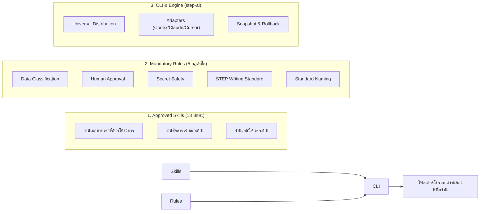
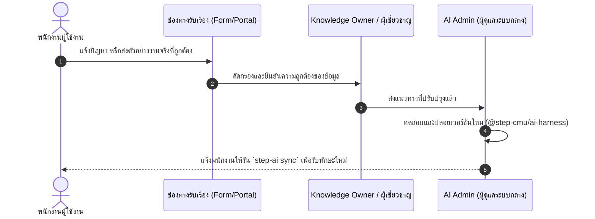

# STeP AI Harness 🚀
### ระบบกำกับดูแลและกระจาย AI Skills & Rules ระดับองค์กร
**อุทยานวิทยาศาสตร์และเทคโนโลยี มหาวิทยาลัยเชียงใหม่ (STeP / RSP North)**

---

## 📌 STeP AI Harness คืออะไร?

**STeP AI Harness** คือชุดโครงสร้างพื้นฐานและมาตรฐานกลางด้าน AI ประจำองค์กร ที่ถูกพัฒนาขึ้นเพื่อให้พนักงานทุกคนใน STeP สามารถใช้งาน AI Agents (เช่น **OpenAI Codex**, **Claude Code**, **Cursor IDE**) ได้อย่างมีประสิทธิภาพ ปลอดภัย และถูกต้องตามระเบียบของมหาวิทยาลัยเชียงใหม่และหน่วยงานราชการ

> [!NOTE]
> **นโยบายระยะทดลอง (Universal Access Model):**  
> **"ยังไม่ต้องแบ่งทีม — ทุก Skill ทุกคนสามารถเข้าถึงได้ทันที"**  
> พนักงานทุกคนสามารถดึงทักษะทั้ง 18 Skills และกฎระเบียบ 5 Rules ไปใช้งานในโฟลเดอร์งานของตนเองได้แบบ 100% ไม่มีข้อจำกัดด้านสังกัดทีม เพื่อสนับสนุนการทำงานร่วมกันแบบข้ามสายงาน (Cross-functional)

---

## 💡 สำหรับ AI Admin: "STeP AI Harness" แตกต่างจาก "Skill ทั่วไป" อย่างไร?

หลายคนอาจเข้าใจว่า Skill คือไฟล์ Prompt ธรรมดา แต่ในระดับองค์กร **Harness คือระบบปฏิบัติการที่คอยควบคุมและปกป้องคุณภาพงาน**:

| ประเด็นเปรียบเทียบ | ❌ Skill ทั่วไปตามเน็ต / Prompt เดี่ยวๆ | ✅ STeP AI Harness (`@step-cmu/ai-harness`) |
|---|---|---|
| **ความน่าเชื่อถือ & คุณภาพ** | ใครเขียนก็ได้ มักเป็นคำสั่งกว้างๆ ขาดความเข้าใจบริบทองค์กร AI มักมั่วข้อมูล (Hallucination) | **Approved Skills**: ถอดบทเรียนจากงานจริงของ STeP ผ่านการตรวจสอบระเบียบสารบรรณ เกณฑ์จัดซื้อจัดจ้าง และระเบียบ มช. |
| **ความปลอดภัย & ความลับ** | ไม่มีระบบควบคุม พนักงานอาจเผลอนำข้อมูลลับ, ร่าง TOR, ข้อมูลส่วนบุคคล (PDPA) หรืองบประมาณป้อนลง AI | **5 Enforced Rules**: ฝังเกณฑ์ควบคุม (Guardrails) ห้าม AI ดึงหรือเผยแพร่ความลับเด็ดขาด และบังคับจำแนกชั้นข้อมูล |
| **การอนุมัติ (Governance)** | พนักงานอาจปล่อยให้ AI ส่งอีเมล หรือสรุปเอกสารแล้วนำไปใช้ทันทีโดยไม่มีใครตรวจ | **Human-in-the-Loop**: กำหนดชัดเจนว่า AI เป็นเพียง "ผู้ช่วยร่าง" (Drafter) อำนาจตัดสินใจและอนุมัติสุดท้ายเป็นของมนุษย์ 100% |
| **การรองรับ AI หลายค่าย** | มักผูกติดกับแอปใดแอปหนึ่ง พอเปลี่ยนเครื่องมือต้องคัดลอก Prompt ใหม่ | **Multi-Agent Agnostic**: มี Adapter ในตัว สร้าง Config ให้พร้อมใช้ทั้ง **Codex**, **Claude**, และ **Cursor** จากมาตรฐานเดียวกัน |
| **การแจกจ่าย & เวอร์ชัน** | ส่งต่อผ่านแชต/ไดรฟ์ ใครอัปเดตอะไรไม่รู้รุ่น พนักงานเสี่ยงเผลอเขียนทับงานเดิม | **CLI Distribution & Safe Sync**: ติดตั้งและอัปเดตผ่านคำสั่ง `step-ai` พร้อมระบบ **Snapshot & Rollback** ไม่เขียนทับไฟล์งานของพนักงาน |
| **การเข้าถึงของบุคลากร** | ต้องมานั่งคัดเลือกว่าใครอยู่ฝ่ายไหน แผนกไหนใช้ได้บ้าง | **Universal Access**: เปิดให้ทุกคนเข้าถึงได้ทุกทักษะทันทีอย่างไร้รอยต่อ |

---

## 🧩 โครงสร้าง 3 ส่วนหลักของ Harness



---

## 📚 รายการ Approved Skills (19 ทักษะที่ทุกคนเข้าถึงได้)

### 1. หมวดงานเอกสาร ราชการ และบริหารโครงการ (Common & PM)
- **`receipt-audit`**: ตรวจสอบใบเสร็จรับเงิน ใบกำกับภาษีตามกฎหมาย พร้อมวินิจฉัยข้ามบริบทกับใบขออนุมัติและระเบียบ มช.
- **`thai-official-documents`**: ร่างและตรวจสอบหนังสือราชการ บันทึกข้อความ ตามระเบียบสารบรรณ
- **`tor-government-writing`**: การร่างขอบเขตของงาน (TOR) ตามมาตรฐานภาครัฐ
- **`tor-review`**: Checklist ตรวจสอบความถูกต้องและจุดเสี่ยงของเอกสาร TOR
- **`meeting-summary`**: แปลงบันทึกการประชุมให้เป็น Action Items พร้อมผู้รับผิดชอบและกำหนดส่งที่ชัดเจน
- **`project-plan`**: จัดทำแผนการดำเนินงาน โครงสร้างตารางเวลา และการติดตามผล
- **`team-weekly-review`**: โครงสร้างการทบทวนงานประจำสัปดาห์ของทีม
- **`sop-authoring`**: การจัดทำคู่มือมาตรฐานการปฏิบัติงาน (Standard Operating Procedure)
- **`customer-support-faq-triage`**: การคัดแยกข้อซักถามและแนวทางตอบคำถามผู้รับบริการ

### 2. หมวดงานสื่อสาร อัตลักษณ์ และงานสร้างสรรค์ (Common & Creative)
- **`step-brand`**: แนวทางและข้อกำหนดอัตลักษณ์ของแบรนด์ STeP
- **`step-writing`**: สำนวนภาษา โทนเสียง (Tone of Voice) และการใช้คำที่เป็นทางการของ STeP
- **`brand-tone-of-voice`**: การปรับระดับภาษาและน้ำเสียงให้เหมาะสมกับผู้รับสารแต่ละกลุ่ม
- **`designer-brief`**: การเขียน Brief สั่งงานออกแบบ ป้าย กราฟิก และสื่อผลิตจริง
- **`event-concept`**: การพัฒนาแนวคิดงานกิจกรรม นิทรรศการ และรูปแบบการจัดบูธ
- **`presentation-design`**: โครงสร้างและการจัดวางเนื้อหาสไลด์นำเสนอให้น่าสนใจและกระชับ

### 3. หมวดความปลอดภัยและการพัฒนาดิจิทัล (Common & Dev)
- **`data-privacy-compliance`**: แนวทางการปฏิบัติตาม พ.ร.บ. คุ้มครองข้อมูลส่วนบุคคล (PDPA)
- **`coding-git-workflow`**: มาตรฐานการพัฒนาซอฟต์แวร์และการเขียนโค้ด
- **`github-workflow`**: ขั้นตอนการใช้ GitHub และการรีวิว Pull Request อย่างปลอดภัย
- **`vercel-deploy`**: แนวทางการ Deploy ระบบเว็บแอปพลิเคชันอย่างเป็นขั้นตอน

---

## ⚡ คู่มือเริ่มใช้งานด่วน (Quick Start ใน 3 ขั้นตอน)

### ขั้นตอนที่ 1: ตั้งค่าสิทธิ์เข้าถึง Private Package (ทำครั้งแรกครั้งเดียว)
แพ็กเกจจัดเก็บอยู่บน GitHub Packages ของ STeP ให้สร้าง [GitHub Personal Access Token](https://github.com/settings/tokens) (เลือกสิทธิ์ `read:packages`) แล้วรันคำสั่งใน Terminal:

**สำหรับ Windows (PowerShell):**
```powershell
Add-Content "$HOME\.npmrc" "@step-cmu:registry=https://npm.pkg.github.com"
Add-Content "$HOME\.npmrc" "//npm.pkg.github.com/:_authToken=YOUR_GITHUB_PAT"
```

**สำหรับ macOS / Linux (Bash):**
```bash
echo "@step-cmu:registry=https://npm.pkg.github.com" >> ~/.npmrc
echo "//npm.pkg.github.com/:_authToken=YOUR_GITHUB_PAT" >> ~/.npmrc
```
*(แทนที่ `YOUR_GITHUB_PAT` ด้วย Token ของคุณ)*

---

### ขั้นตอนที่ 2: ติดตั้งเครื่องมือ `step-ai`
```bash
npm install --global @step-cmu/ai-harness
```
ตรวจความพร้อมของระบบ:
```bash
step-ai doctor
```

---

### ขั้นตอนที่ 3: ติดตั้ง Skills เข้าโฟลเดอร์งาน (`step-ai init`)
เปิด Terminal ในโฟลเดอร์โปรเจกต์งานที่คุณต้องการใช้งาน AI แล้วรันคำสั่ง:

```bash
# ค่าเริ่มต้น: ติดตั้งทุก Skill สำหรับ OpenAI Codex Desktop (Universal Access)
step-ai init

# หรือระบุเครื่องมือที่ต้องการ:
step-ai init --tool codex       # สำหรับ OpenAI Codex Desktop
step-ai init --tool claude      # สำหรับ Claude Code หรือ Claude Desktop
step-ai init --tool cursor      # สำหรับ Cursor IDE
step-ai init --tool all         # ติดตั้ง Config ให้ครบทุกเครื่องมือพร้อมกัน
```

> [!TIP]
> **ระบบจะสร้างไฟล์และโฟลเดอร์ให้คุณอัตโนมัติ:**
> - โฟลเดอร์ `skills/` (ทักษะทั้งหมด 18 ทักษะ)
> - โฟลเดอร์ `rules/` (กฎควบคุมความปลอดภัย 5 ข้อ)
> - ไฟล์คำสั่ง Agent: `CODEX_INSTRUCTIONS.md`, `CLAUDE.md`, หรือ `.cursorrules` ตามเครื่องมือที่เลือก
> 
> หลังจากนั้น เพียงเปิดโฟลเดอร์ในโปรแกรม AI ที่คุณเลือก ก็สั่งงานได้ทันที!

---

## 🛠️ คำสั่งที่ใช้งานบ่อยสำหรับทุกคน

| คำสั่ง | หน้าที่การทำงาน |
|---|---|
| `step-ai init` | ติดตั้ง Approved Skills และ Rules เข้าโฟลเดอร์งานปัจจุบัน |
| `step-ai status` | ตรวจสอบว่าไฟล์ในโฟลเดอร์สมบูรณ์ หรือมีไฟล์ไหนที่คุณปรับแก้เอง |
| `step-ai sync` | ดึง Skills เวอร์ชันล่าสุดขององค์กรมาอัปเดต (ปลอดภัย: มีระบบสำรองข้อมูล และ**ไม่เขียนทับงานเดิม**) |
| `step-ai rollback` | ย้อนกลับโฟลเดอร์ไปยังเวอร์ชันก่อนหน้า หากอัปเดตแล้วเกิดข้อผิดพลาด |
| `step-ai doctor` | ตรวจสอบการเชื่อมต่อสิทธิ์และการตั้งค่าในเครื่อง |

---

## 🔄 กระบวนการเสนอแนะปรับปรุง Skill (โดยไม่ต้องใช้ Git)

พนักงานทุกคนสามารถช่วยให้ AI ขององค์กรเก่งขึ้นและฉลาดขึ้นได้ผ่านขั้นตอนง่ายๆ 4 ขั้น:



**สิ่งที่พนักงานต้องระบุเมื่อส่งข้อเสนอ:**
1. **งานที่กำลังทำ:** (เช่น กำลังร่างหนังสือขออนุมัติ หรือตรวจเอกสาร TOR)
2. **สิ่งที่พบ:** (เช่น AI ตอบภาษาไม่เป็นทางการ หรือใช้ฟอนต์ผิดระเบียบ)
3. **สิ่งที่ควรจะเป็น / ตัวอย่างงานที่ดี:** (แนบไฟล์ตัวอย่างงานที่เคยผ่านการอนุมัติจริง)

---

## 🔒 กฎเหล็กด้านความปลอดภัย (Mandatory Safety Rules)

1. **Human-in-the-loop**: ผลลัพธ์จาก AI เป็นเพียงร่างเริ่มต้น เจ้าของงานที่เป็นมนุษย์ต้องอ่าน ตรวจทาน และอนุมัติด้วยตนเองเสมอ
2. **ห้ามป้อนข้อมูลความลับ**: ห้ามกรอกเลขบัตรประชาชน ข้อมูลเงินเดือน รหัสผ่าน หรือสัญญาที่ยังไม่ได้ลงนามลงใน Prompt
3. **ยึดความจริง (No Hallucination)**: หากข้อมูลต้นฉบับไม่เพียงพอ AI จะต้องแจ้งว่า "ไม่มีข้อมูลยืนยัน" ห้ามคาดเดาหรือแต่งข้อมูลขึ้นมาเอง

---

## 👥 สำหรับผู้ร่วมพัฒนา Harness (Developer / Maintainer)

```bash
# ตรวจสอบความถูกต้องและสแกน Secret ในคลัง
py scripts/validate_repo.py

# รันชุดทดสอบความถูกต้องของ CLI & Adapters
npm test
```
