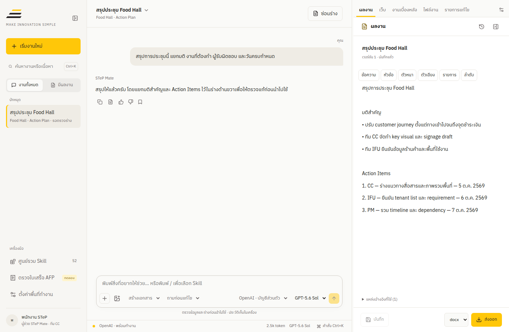
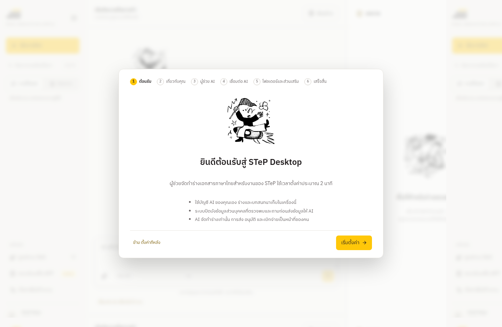
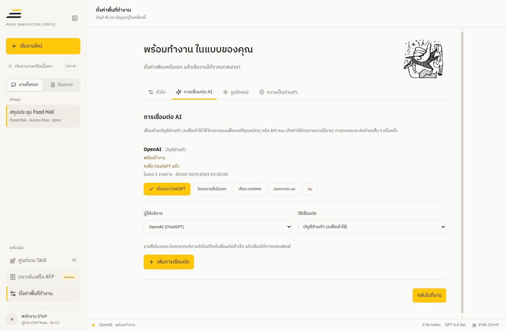
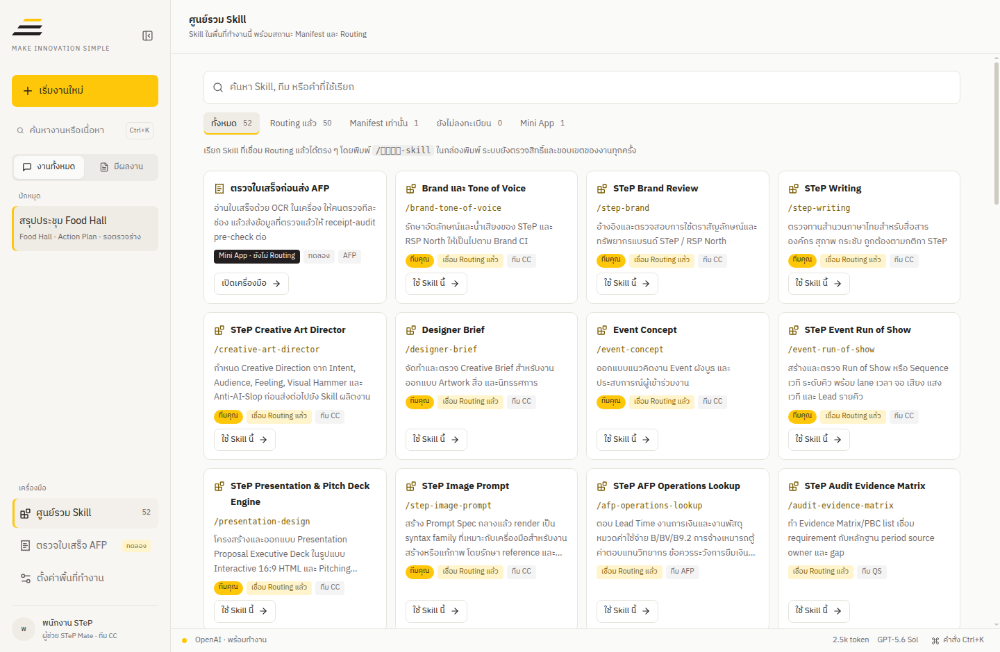
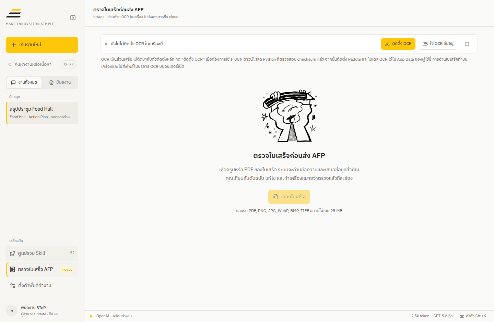

# STeP AI

**STeP Desktop** คือหน้าจอทำงานหลักของ STeP AI Harness สำหรับพนักงาน STeP / RSP North ใช้สำหรับคุยกับ AI, แนบเอกสาร, ใช้ Skill/Playbook, ตรวจร่าง, ส่งออกไฟล์ และใช้เครื่องมือเฉพาะ เช่น **ตรวจใบเสร็จก่อนส่ง AFP** โดยไม่ต้องใช้ Git, Terminal หรือจำชื่อ Skill

> สำหรับผู้ใช้ทั่วไป: เริ่มจาก **STeP Desktop GUI**  
> สำหรับผู้ดูแล/นักพัฒนา: รายละเอียด Harness, Router, manifests และ CLI อยู่ช่วงท้ายของ README นี้

**เอกสารที่เกี่ยวข้อง:** [คู่มือพนักงาน](docs/employee-guide.md) · [คู่มือ Desktop สำหรับนักพัฒนา](desktop/README.md) · [STeP AI Support](SUPPORT.md)

---

## เริ่มใช้งานแบบสั้นที่สุด

1. รับตัวติดตั้ง **STeP Desktop** จาก Shared Drive หรือช่องทางภายในที่องค์กรอนุมัติ
2. ติดตั้งและเปิดแอป
3. ทำ Setup Wizard ครั้งแรก
4. เชื่อมบัญชี AI ที่คุณมีอยู่แล้ว
5. กด **เริ่มงานใหม่**
6. พิมพ์งานเป็นภาษาไทยตามปกติ
7. ตรวจคำตอบหรือร่างในแถบ **ผลงาน**
8. แก้ไขเองก่อนกด **ส่งออก** หรือใช้ต่อ

ตัวอย่างงานแรก:

> ช่วยตรวจเอกสารนี้ก่อนส่ง สรุปจุดที่ขาดและสิ่งที่ฉันต้องแก้เอง

หรือ:

> สรุปการประชุมนี้ แยกมติ งานที่ต้องทำ ผู้รับผิดชอบ วันครบกำหนด และเรื่องที่ยังรอยืนยัน

STeP AI จะเลือก Skill หรือ Playbook ที่เหมาะสมให้เองในงานส่วนใหญ่ ไม่จำเป็นต้องเลือกจากรายการก่อนทุกครั้ง

## หน้าตา STeP Desktop



> ภาพจาก Electron build จริงของ STeP Desktop โดยใช้ข้อมูลตัวอย่างสำหรับเอกสารนี้

---

# 1. ติดตั้ง STeP Desktop

## Windows

ไฟล์ติดตั้งมีรูปแบบ:

```text
STeP-Desktop-Setup-<version>.exe
```

เปิดไฟล์ติดตั้ง แล้วทำตามขั้นตอนบนหน้าจอ ตัวติดตั้งเป็นแบบ per-user และสร้าง shortcut ให้ตามการตั้งค่าของ installer

## macOS

ไฟล์มีรูปแบบ:

```text
STeP-Desktop-<version>-arm64.dmg
STeP-Desktop-<version>-x64.dmg
```

เลือกให้ตรงกับเครื่อง จากนั้นเปิด DMG และย้าย **STeP Desktop** ไปที่ Applications

หาก macOS แสดงคำเตือนเกี่ยวกับผู้พัฒนา ให้ตรวจว่าไฟล์มาจากช่องทางที่องค์กรอนุมัติก่อน แล้วใช้ขั้นตอนที่ผู้ดูแลกำหนด อย่าข้ามคำเตือนให้ไฟล์ที่ไม่ทราบแหล่งที่มา

## แหล่งที่ควรใช้

ชุดสำหรับพนักงานต้องมาจาก **Shared Drive หรือช่องทางภายใน** ที่ระบุว่าอนุมัติให้ใช้แล้ว

อย่าใช้ไฟล์จาก Public GitHub Release แทนชุดภายในโดยถือว่าได้รับอนุมัติอัตโนมัติ เพราะ “มี release” กับ “อนุมัติให้พนักงานใช้” เป็นคนละขั้นตอน

---

# 2. Setup Wizard ครั้งแรก

เมื่อเปิด STeP Desktop ครั้งแรก ระบบจะพาผ่าน 6 ขั้นตอน

| ขั้นตอน | สิ่งที่ตั้งค่า |
| --- | --- |
| 1. ต้อนรับ | ภาพรวมว่าข้อมูลและร่างเก็บอย่างไร |
| 2. เกี่ยวกับคุณ | ชื่อเรียกและทีมหลัก |
| 3. ผู้ช่วย AI | ชื่อผู้ช่วยและสไตล์การพูด |
| 4. เชื่อมต่อ AI | ChatGPT / Gemini / Claude / API |
| 5. โฟลเดอร์และส่วนเสริม | Workspace และ OCR แบบ optional |
| 6. เสร็จสิ้น | เข้าใช้งานหรือเปิด Tour |

ทีมหลักช่วย Router เลือก Skill ที่ตรงบริบทของคุณมากขึ้น แต่ถ้ายังไม่แน่ใจสามารถเลือกภายหลังได้

ชื่อผู้ช่วยและสไตล์การพูดสามารถเปลี่ยนได้ใน **ตั้งค่าพื้นที่ทำงาน**



*Setup Wizard จริงของ STeP Desktop — เริ่มจากข้อมูลผู้ใช้ ผู้ช่วย AI การเชื่อมต่อ และส่วนเสริม*

---

# 3. เชื่อมต่อ AI

เปิด:

**ตั้งค่าพื้นที่ทำงาน → การเชื่อมต่อ AI**

STeP Desktop รองรับหลายวิธี โดยแต่ละ connection แยก profile ออกจากกัน

| Provider | วิธีที่ใช้ได้ |
| --- | --- |
| OpenAI | ลงชื่อ ChatGPT ผ่าน browser หรือ API key |
| Gemini | ลงชื่อ Google ผ่าน browser หรือ API key |
| Claude | Claude Console OAuth, API key และ Claude Code ภายนอก |
| Claude Pro/Max | ใช้ผ่าน Claude Code ภายนอกเป็นค่าเริ่มต้น; direct in-app subscription ใช้เฉพาะ deployment ที่ได้รับอนุมัติ |

### ChatGPT

เลือก:

```text
OpenAI (ChatGPT)
→ บัญชีส่วนตัว (ลงชื่อเข้าใช้)
→ เชื่อมต่อ ChatGPT
```

Browser จะเปิดหน้าลงชื่อเข้าใช้ เมื่อเสร็จ STeP Desktop จะตรวจสถานะบัญชีและทดสอบ connection

### Gemini

เลือก:

```text
Gemini (Google)
→ บัญชีส่วนตัว (ลงชื่อเข้าใช้)
→ เชื่อมต่อ Google
```

บัญชี Google Workspace/องค์กรบางบัญชีอาจต้องระบุ **Google Cloud Project ID** ส่วนบัญชีส่วนตัวทั่วไปปล่อยว่างได้

Gemini CLI เป็นผู้จัดการ browser OAuth และ local callback โดยตรง ไม่ต้องคัดลอก authorization code มาใส่ใน STeP Desktop

### Claude

มี 3 แนวทางหลัก:

- **Claude Console OAuth** — ไม่ต้องใส่ API key แต่ใช้ billing/quota ของ Claude Console/API workspace
- **API key**
- **Claude Pro/Max ผ่าน Claude Code ภายนอก** — STeP Desktop คัดลอกงานและเปิด Claude Code ในโฟลเดอร์งาน

การเชื่อมต่อแต่ละรายการมีปุ่ม **เชื่อมต่อ**, **โหลดรายชื่อโมเดล**, **ออกจากระบบ** และ **ลบ**



*หน้าการเชื่อมต่อ AI จริง แสดงสถานะบัญชี โมเดล และการเพิ่ม connection ใหม่*

---

# 4. รู้จักหน้าจอหลัก

STeP Desktop แบ่งการทำงานหลักเป็น 3 ส่วน

```text
┌────────────────┬────────────────────────────┬──────────────────────┐
│ งาน / เครื่องมือ │        บทสนทนา AI          │        ผลงาน          │
│                │                            │                      │
│ งานทั้งหมด      │ Prompt / Attach / Model    │ ร่างที่แก้ไขได้       │
│ มีผลงาน         │ Reasoning / Status         │ Version history      │
│ Skill           │                            │ Sources              │
│ ใบเสร็จ AFP     │                            │ Export               │
└────────────────┴────────────────────────────┴──────────────────────┘
```

## แถบซ้าย — งานและเครื่องมือ

ใช้สำหรับ:

- **เริ่มงานใหม่**
- ค้นหางานหรือเนื้อหา
- ดู **งานทั้งหมด**
- กรองเฉพาะงานที่ **มีผลงาน**
- ปักหมุด เปลี่ยนชื่อ หรือลบงาน
- เปิด **ศูนย์รวม Skill**
- เปิด **ตรวจใบเสร็จ AFP**
- เปิด **ตั้งค่าพื้นที่ทำงาน**

การกด **เริ่มงานใหม่** หมายถึงเริ่ม task context ใหม่ งานก่อนหน้าจะไม่ถูกนำมาปะปนโดยอัตโนมัติ

## ตรงกลาง — คุยกับ AI

กล่องพิมพ์รองรับ:

- พิมพ์คำขอภาษาไทยตามธรรมชาติ
- แนบเอกสาร
- เลือก AI connection
- เลือก model
- เลือก reasoning level ถ้า provider รองรับ
- พิมพ์ `/` เพื่อเลือก Skill โดยตรง
- กด Enter เพื่อส่ง และ Shift+Enter เพื่อขึ้นบรรทัดใหม่
- หยุดงานที่กำลังทำได้

โดยปกติ **ไม่ต้องเลือก Skill เอง** Router จะดูงานล่าสุดแล้วเลือก Skill/Playbook ที่เหมาะสม

ใช้ `/skill-name` เฉพาะเมื่อคุณต้องการบังคับวิธีทำงาน เช่น ต้องการใช้ Skill เฉพาะเจาะจง

## แถบขวา — ผลงาน

กด **เปิดร่าง** เพื่อดูพื้นที่ผลงาน

เมื่อ AI เสนอร่าง คุณสามารถ:

1. อ่านข้อเสนอ
2. กด **ใช้ร่างนี้** หรือ **ไม่ใช้**
3. แก้ไขข้อความเอง
4. จัดหัวข้อ ตัวหนา ตัวเอียง รายการ หรือลำดับ
5. ดู Version history และคืนเวอร์ชันเก่า
6. ดูแหล่งอ้างอิงที่ใช้
7. ส่งออกเป็น `DOCX`, `PDF`, `MD`, `XLSX` หรือ `PPTX`

AI ไม่เขียนทับร่างของคุณเงียบ ๆ ข้อเสนอใหม่จะถูกเก็บเป็น proposal ให้คุณเลือกก่อน

---

# 5. วิธีทำงานประจำวันที่แนะนำ

## งานทั่วไป

กด **เริ่มงานใหม่** แล้วบอก:

> ช่วยร่างอีเมลตอบกลับเรื่องนี้ให้สุภาพและกระชับ

งานทั่วไปที่ไม่ต้องใช้ workflow เฉพาะจะทำงานในโหมด General

## ตรวจเอกสาร

1. กด **เริ่มงานใหม่**
2. กดรูปคลิปหนีบกระดาษ
3. เลือกเอกสาร
4. ตรวจ preview/ข้อความที่ระบบอ่านได้
5. พิมพ์สิ่งที่ต้องการ เช่น

> ช่วยตรวจเอกสารนี้ก่อนส่ง สรุปจุดที่ขาดและสิ่งที่ฉันต้องแก้เอง

STeP Desktop จำกัดหนึ่ง source attachment ต่อ request สำหรับ workflow ที่ต้องรักษา source ชัดเจน หากต้องรวมหลายเอกสารควรบอกเจตนาให้ชัดหรือแยกงาน

## สรุปประชุม

> สรุปการประชุมนี้ แยกมติ งานที่ต้องทำ ผู้รับผิดชอบ วันครบกำหนด และเรื่องที่ยังรอยืนยัน

## หนังสือ/ข้อความราชการ

> ร่างหนังสือขอความอนุเคราะห์ใช้สถานที่ด้วยภาษาสุภาพ กระชับ และให้ฉันตรวจทานก่อนส่ง

## TOR / งานจัดซื้อ

> ช่วยตรวจ TOR นี้ แยกข้อเท็จจริง ความเสี่ยง และข้อมูลที่ต้องให้เจ้าของงานยืนยันก่อนส่ง AFP

## TOR → Project Plan

> เอา TOR นี้มาแตกกิจกรรม ระยะเวลา milestone และ dependency แล้วเตรียมแผนสำหรับทำ Gantt

งานลักษณะนี้สามารถเข้า Playbook หลายขั้นแทนการใช้ Skill เดี่ยว

## Privacy review

> ช่วยตรวจเอกสารนี้ว่ามีข้อมูลส่วนบุคคลหรือ credential ที่ไม่ควรส่งต่อหรือไม่ และเสนอจุดที่ควรปิดบัง

## ISO / QMS

> ช่วยเตรียมเอกสารสำหรับ audit ISO ปีนี้

ถ้า Harness ไม่มี controlled source ที่จำเป็น ระบบควรระบุว่า source ยังไม่พร้อม แทนการเดาระเบียบหรือข้อกำหนด

---

# 6. ศูนย์รวม Skill

เปิด **ศูนย์รวม Skill** จากแถบซ้าย

หน้านี้ใช้สำหรับดูว่า STeP AI มีวิธีทำงานอะไรอยู่บ้าง และ Skill ใดเกี่ยวข้องกับทีมของคุณ

วิธีใช้มี 2 แบบ:

**แบบปกติ — พิมพ์งานตรง ๆ**

> ช่วยตรวจ TOR นี้ก่อนส่ง AFP

Router จะเลือก Skill ให้

**แบบเลือกเอง**

เปิด Skill แล้วกดใช้ หรือพิมพ์ `/` ในช่องข้อความแล้วเลือก Skill

เหมาะเมื่อคุณรู้ว่าต้องการ workflow ใดแน่นอน



*Skill Hub จริง แสดง Skill ที่ Router ใช้ได้ สถานะ Manifest/Routing และ Skill ของทีมผู้ใช้*

---

# 7. ตรวจใบเสร็จก่อนส่ง AFP

เปิด:

**เครื่องมือ → ตรวจใบเสร็จ AFP**

OCR เป็นส่วนเสริมหลังติดตั้ง STeP Desktop คนที่ไม่ใช้ไม่ต้องดาวน์โหลด runtime OCR



*หน้า Receipt AFP จริงก่อนติดตั้ง OCR — ผู้ใช้ติดตั้งส่วนเสริมเฉพาะเครื่องที่ต้องใช้*

## ครั้งแรก

กด **ติดตั้ง OCR**

ระบบจะเตรียม Python/PaddleOCR และโมเดลที่จำเป็นไว้ใน App Data ของผู้ใช้ หลังติดตั้งแล้วจึงเปิด local OCR service

หากต้องอ่านลายมือ กด **เพิ่มอ่านลายมือ** เพื่อเพิ่ม Thai-TrOCR ภายหลัง

ถ้าเครื่องมี **Tesseract 5 พร้อมภาษา tha + eng** ระบบจะตรวจพบและใช้เป็นตัวตรวจซ้ำสำหรับข้อความพิมพ์/ตัวเลขโดยอัตโนมัติ

## ขั้นตอนตรวจใบเสร็จ

1. กด **เลือกใบเสร็จ**
2. เลือก PDF, PNG, JPG, WebP, BMP หรือ TIFF
3. OCR อ่านเอกสารบนเครื่อง
4. ระบบ map ข้อมูลเข้า field เช่น ร้านค้า, เลขที่ใบเสร็จ, วันที่, Tax ID, subtotal, VAT และ total
5. ถ้าหลาย engine อ่านไม่ตรงกัน ระบบจะแสดง candidate และไม่เดาแทนคุณ
6. เทียบค่ากับภาพต้นฉบับ
7. ติ๊ก **ตรวจแล้ว** ในช่องที่ยืนยันแล้ว
8. กด **AI กรอง OCR อีกชั้น** ได้ถ้าต้องการ
9. กด **ให้ AI pre-check ต่อ** เพื่อสร้าง Workspace งานตรวจใบเสร็จ

### OCR หลายชั้น

```text
PaddleOCR          → OCR หลัก
Tesseract          → ตรวจซ้ำตัวพิมพ์และตัวเลข
Thai-TrOCR         → candidate สำหรับลายมือ
EasyOCR (optional) → second opinion
        ↓
AFP field mapping
        ↓
mapped / ambiguous / unmapped
```

Tesseract ไม่ได้ถูกใช้เป็น handwriting authority และ candidate จากลายมืออย่างเดียวจะไม่ถูก auto-confirm

### AI กรอง OCR อีกชั้น

ปุ่ม **AI กรอง OCR อีกชั้น** ใช้ AI connection ที่คุณเลือกอยู่เพื่อช่วยตัดสิน semantic mapping แต่มีข้อจำกัด:

- ไม่ส่งภาพใบเสร็จให้ AI resolver
- ข้อมูล OCR ผ่าน privacy filtering ก่อน
- candidate value ถูกแทนด้วย local token
- AI เลือกได้เฉพาะ candidate ที่ OCR สร้างไว้
- AI ไม่มีสิทธิสร้างยอดเงิน, Tax ID, วันที่ หรือเลขเอกสารใหม่
- ถ้าไม่แน่ใจต้องคืน `ambiguous` / `unmapped`
- ค่าที่ AI แนะนำยังเป็น **unconfirmed** จนกว่าคนจะตรวจ

เมื่อส่งต่อไป Workspace ระบบเก็บ `afp_mapping`, candidate, evidence และ unmapped OCR lines ไว้ด้วย จึงไม่ตีความว่า “ช่องว่าง = OCR ไม่พบข้อมูล” โดยอัตโนมัติ

---

# 8. Context และ Workspace

แต่ละงานในแถบซ้ายคือ Workspace session ของตัวเอง

กติกาหลัก:

- **เริ่มงานใหม่** → เริ่ม context ใหม่
- ถามต่อในงานเดิม → ใช้เฉพาะ context ที่เกี่ยวข้องกับงานนั้น
- ถ้าเปลี่ยนหัวข้อแบบไม่เกี่ยวข้อง → Harness ไม่ควรลาก Skill/source เก่ามาปน
- ถ้าพูดว่า “เรื่องเมื่อกี้”, “ต่อจากเดิม”, “ใบเสร็จเมื่อกี้” → ระบบสามารถเชื่อม context ที่เกี่ยวข้องกลับมา
- structured source เช่น receipt JSON จะอยู่กับ Workspace และใช้ต่อใน follow-up ของงานเดียวกัน

แนวทางนี้ช่วยลดปัญหา Context Bleed เช่น คุยเรื่องใบเสร็จแล้วถามเรื่องระเบียบใหม่ แต่ AI ยังตอบติดบริบทใบเสร็จ

---

# 9. Privacy และจุดยืนยัน

ก่อนส่งข้อมูลไป AI, STeP Desktop มี privacy review และจุดยืนยันตามลักษณะงาน

ใช้เฉพาะโปรแกรม AI และช่องทางที่องค์กรอนุมัติ

**ห้ามใส่รหัสผ่าน, token, cookie, MFA หรือ secret**

ถ้าระบบแจ้งข้อมูลความเสี่ยงสูง ให้หยุดและตรวจเจ้าของข้อมูล/สิทธิ์ก่อนดำเนินการ

ตัวอย่างขอบเขต:

| งาน | พฤติกรรมที่คาดหวัง |
| --- | --- |
| สรุป วิเคราะห์ ร่างเอกสาร | AI ช่วยทำร่างได้ |
| กรอกฟอร์มแต่ยังไม่ Submit | เตรียมข้อมูลได้ |
| กด Submit / ส่งอีเมลแทน | ต้องให้คนยืนยัน |
| อนุมัติเบิกเงินจริง | AI ทำแทนไม่ได้ |
| เลือกผู้ชนะจัดซื้อ | AI ทำแทนไม่ได้ |
| ปิด NC/CAPA ทางการ | AI ทำแทนไม่ได้ |
| ออกรายงานผลแล็บอย่างเป็นทางการ | AI ทำแทนไม่ได้ |
| ให้คะแนน/จัดอันดับพนักงาน | AI ทำแทนไม่ได้ |

รายละเอียดเพิ่มเติม: [Privacy preflight](docs/privacy-preflight.md) · [Action verification](docs/action-verification.md)

---

# 10. ทำไมบางครั้ง AI บอกว่า Source ยังไม่พร้อม

Harness แยก “รู้วิธีทำงาน” ออกจาก “มี source ที่อนุมัติให้อ้างได้”

ตัวอย่าง:

- รู้วิธีตรวจ TOR ไม่ได้แปลว่ามีระเบียบพัสดุฉบับล่าสุด
- รู้วิธีตรวจใบเสร็จไม่ได้แปลว่ามีเพดาน/สิทธิเบิกที่ยืนยันแล้ว
- รู้วิธีเตรียม ISO audit ไม่ได้แปลว่ามี controlled QMS documents ทุกฉบับ
- ISO 9001:2015 อาจถูกระบุเป็น normative source แต่ตัวข้อความมาตรฐานไม่ได้อยู่ใน package

เมื่อ source ที่ต้องใช้ยังไม่มี ระบบควรแสดง `partial`, `NEED-SOURCE` หรือคำเตือนที่เทียบเท่า แทนการสร้างข้อกำหนดขึ้นเอง

---

# 11. เมื่อมีปัญหา

## AI ยังไม่พร้อม

ดู status bar ด้านล่าง ถ้าแสดง **ยังไม่เชื่อมต่อ AI**

ไปที่:

**ตั้งค่าพื้นที่ทำงาน → การเชื่อมต่อ AI**

แล้วกดเชื่อมต่อ/ทดสอบใหม่

## Login เปิด browser แต่กลับเข้าแอปไม่ได้

ลอง **ยกเลิก** แล้วเชื่อมใหม่

สำหรับ Gemini ให้ปล่อย browser OAuth/local callback ทำงานจนจบ ไม่ต้องนำ authorization code มาวางเอง

## OCR ไม่พร้อม

เปิด **ตรวจใบเสร็จ AFP**

- ถ้ายังไม่ติดตั้ง → กด **ติดตั้ง OCR**
- ติดตั้งแล้วแต่ service ปิด → กด **เปิดบริการ OCR**
- ต้องอ่านลายมือ → กด **เพิ่มอ่านลายมือ**
- ต้องการ Tesseract → ใช้ปุ่ม **วิธีติดตั้ง** แล้วติดตั้ง `tha + eng`

## AI เลือกงานผิด

เริ่มจากเขียน intent ให้ชัด เช่น:

> ตรวจ TOR นี้เรื่องขอบเขตงานและเกณฑ์ตรวจรับ

ถ้าต้องการบังคับ ให้พิมพ์ `/` แล้วเลือก Skill โดยตรง

## งานหนึ่งปนกับอีกงานหนึ่ง

กด **เริ่มงานใหม่** เมื่อต้องการเปลี่ยน task จริง ๆ

## ส่งปัญหาให้ผู้ดูแล

ถ่ายภาพหน้าจอพร้อมข้อความผิดพลาด โดยปิดบังข้อมูลอ่อนไหว แล้วส่งผ่าน [STeP AI Support](SUPPORT.md)

---

# 12. สิ่งที่ควรรู้ก่อนนำผลลัพธ์ไปใช้

STeP AI เป็น workspace สำหรับช่วยเตรียมงาน ไม่ใช่ผู้มีอำนาจอนุมัติ

ก่อนใช้ผลลัพธ์:

- ตรวจข้อเท็จจริง
- ตรวจ source
- ตรวจตัวเลข/ชื่อ/วันที่
- ตรวจว่าคุณมีสิทธิ์ส่งข้อมูลนั้น
- ตรวจร่างก่อนส่งออกหรือเผยแพร่
- งานที่มีผลทางการเงิน จัดซื้อ QMS บุคลากร หรือการรับรอง ต้องให้ผู้มีอำนาจจริงเป็นผู้ตัดสิน

---

# 13. สำหรับผู้ดูแลและนักพัฒนา

README ส่วนบนตั้งใจให้เป็น **GUI-first employee guide** ส่วนรายละเอียดเชิงระบบยังอยู่ใน repo

## Version / inventory

README ฉบับนี้อ้างอิง Harness source **v0.7.6** และ STeP Desktop **v0.5.7**

| รายการใน Harness source | จำนวน |
| --- | --- |
| ทีม | **22 ทีม** |
| กลุ่ม routing | **5 กลุ่ม** |
| Skills | **51 Skills** |
| Playbooks | **5 Playbooks** |
| Actions | **4 Actions** |

Router มีเส้นทางเลือก Skill 50 รายการ ส่วน `step-router` เป็น routing/orchestration Skill

ต้นทาง: [Skills](manifest/skills.yaml) · [Router index](manifest/router-index.yaml) · [Playbooks](manifest/playbooks.yaml) · [Actions](manifest/actions.yaml)

ตารางนี้นับจาก source ไม่ใช่รายการรับรองของ ZIP ที่พนักงานได้รับ

## สถาปัตยกรรมโดยย่อ

```text
STeP Desktop GUI
      ↓
Current task / source
      ↓
Router
      ↓
Skill / Playbook
      ↓
Source readiness
      ↓
Authority + Privacy
      ↓
Provider
      ↓
Proposal / verified output
```

อ่านต่อ: [Architecture](docs/architecture.md) · [Router](docs/step-router.md) · [Playbooks](docs/playbooks.md)

## Repository visibility

repository นี้มีสถานะ **Public** จึงห้าม commit เอกสารภายใน, credential, token, ข้อมูลพนักงาน หรือข้อมูลลูกค้าที่ไม่ควรเผยแพร่

## Release

ชุดติดตั้งที่แจกพนักงานมาจาก **release tag เท่านั้น** ไม่ใช่จาก `main`

การมี build หรือ GitHub Release ไม่ได้แปลว่าอนุมัติให้พนักงานใช้แล้ว ผู้ดูแลต้องผ่าน Release Gate และแจกผ่านช่องทางภายในที่อนุมัติ

ดู: [Pilot Operations](docs/pilot-operations.md) · [Pilot Runbook](docs/pilot-runbook.md) · [CHANGELOG](CHANGELOG.md)

## Development

Harness:

```sh
npm test
npm run validate
```

Desktop:

```sh
npm --prefix desktop ci
npm run desktop:build
npm run desktop:test
npm run desktop:start
```

รายละเอียด packaging และข้อจำกัดของ Electron build อยู่ใน [desktop/README.md](desktop/README.md)

## Legacy CLI / folder workflow

CLI, `START-HERE.md`, `Install-STeP-AI.bat`, `Install-STeP-AI.command`, privacy preflight scripts และ workflow แบบเปิดโฟลเดอร์ด้วย AI client ยังอยู่เพื่อรองรับ pilot/legacy use case

สำหรับผู้ใช้ใหม่ ให้เริ่มจาก **STeP Desktop GUI** ก่อน แล้วใช้ CLI เฉพาะเมื่อ workflow ของทีมจำเป็นต้องใช้

---

## เป้าหมายสำหรับผู้ใช้หลังอ่าน README นี้

ผู้ใช้ควร:

- ติดตั้งและเปิด STeP Desktop บน Windows หรือ macOS ได้
- ผ่าน Setup Wizard และเลือกทีมได้
- เชื่อมต่อ ChatGPT, Gemini หรือ Claude ได้ตามสิทธิ์ที่มี
- เริ่มงานใหม่และพิมพ์งานแรกเป็นภาษาไทยได้
- แนบเอกสารและรู้ว่าควรตรวจ source ก่อนใช้
- ตรวจ proposal และแก้ร่างในแถบ **ผลงาน** ได้
- ส่งออกไฟล์จาก GUI ได้
- ใช้ Skill โดยไม่ต้องจำชื่อทั้งหมด
- ใช้ **ตรวจใบเสร็จ AFP** และเข้าใจว่า OCR/AI candidate ยังต้องให้คนยืนยัน
- รู้ว่าเมื่อใดต้องหยุดให้มนุษย์ยืนยัน
- รู้ว่าจะส่งปัญหาผ่าน [STeP AI Support](SUPPORT.md) อย่างไร
