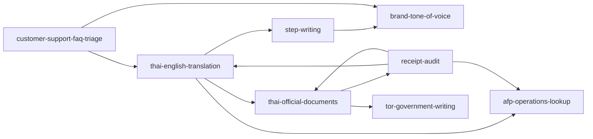

# การเชื่อมโยง Skill งานภาษาไทย

สถานะ: วิธีการดัดแปลงวันที่ 6 ตุลาคม 2569 จาก claude-thai-skills @ `62929a2092e193a64676170a58b8286eaf41c4bc` ตัวอย่างเป็นข้อมูลสังเคราะห์; ยังไม่ได้วัดคุณภาพคำตอบแบบ model-side ของการปรับครั้งนี้

## เลือกตามผลลัพธ์ที่ผู้ใช้ต้องการ

| ผลลัพธ์ | Skill หลัก | รับความช่วยเหลือ/ส่งต่อเมื่อจำเป็น |
|---|---|---|
| คำแปลที่เทียบต้นฉบับได้ | thai-english-translation (draft) | step-writing ปรับสำนวน; thai-official-documents ตรวจแบบ; AFP ตรวจข้อกำหนดคำแปลรับรองในงานเบิก |
| บันทึกหรือหนังสือตามแบบ | thai-official-documents | tor-government-writing สำหรับสาระ TOR; meeting-summary สำหรับแยกมติ; receipt-audit ตรวจใบเสร็จแนบ |
| โพสต์/ประกาศจากข้อมูลต้นเรื่อง | step-writing | brand-tone-of-voice ตรวจน้ำเสียงแบรนด์; thai-english-translation เมื่อต้องแปล |
| คำตอบผู้รับบริการ | customer-support-faq-triage | Service Registry ยืนยันปลายทาง; brand-tone-of-voice ตรวจน้ำเสียง; translation แปลคำตอบที่ตรวจสาระแล้ว |
| ผลตรวจก่อนส่ง AFP | receipt-audit | afp-operations-lookup ตรวจข้อกำหนดปัจจุบัน; thai-official-documents ร่างบันทึกนำส่ง; translation ช่วยอ่านความหมาย |

ลูกศรคือเกณฑ์ส่งต่อเมื่อเปลี่ยนผลลัพธ์ที่ต้องการ ไม่ใช่การรันทุก Skill อัตโนมัติ ไม่โหลดทั้งกราฟในทุกคำขอ และไม่ถือการส่งต่อในคำตอบเป็นหลักฐานว่าติดต่อบุคคลจริงแล้ว Privacy และ Human Authority ยังคงใช้ในแต่ละขั้น

## Desktop และการจัดรูปแบบ

- TOR ใช้ tor-government-writing เป็นหลัก และ thai-official-documents ช่วยรูปแบบ
- บันทึก/หนังสือใช้ thai-official-documents; เพิ่มช่องข้อพิจารณาในฟอร์มบันทึก
- โครงการใช้ project-plan; รายงานประชุมใช้ meeting-summary และ thai-official-documents
- ทุกฟอร์มโหลด `thai-data-formatting.md` เข้า model context จริง งานที่มีเอกสารทางการโหลด `drafting-checks.md` เพิ่มจาก Skill/working template เดิม
- ฟอร์มบันทึกและหนังสือเก็บวันที่ต้นฉบับกับค่าจัดรูปแบบแยกกัน ข้อความหลายวัน/ปีสั้น/วันที่ไม่มีจริงใช้ DATE_NEEDS_REVIEW การจัดรูปแบบไม่ยกระดับ USER_INPUT หรือ EXTRACTED_UNVERIFIED
- ตัว parser วันที่ใน Desktop ใช้ร่วมกับหน้าตรวจใบเสร็จ ไม่เติมศตวรรษให้ปีสองหลัก ใช้ปีเต็มที่เจ้าของยืนยันก่อนคำนวณกำหนดเวลา

## ขอบเขตและหลักฐาน

- ใหม่เฉพาะ Skill การแปล เริ่ม draft ไม่เพิ่ม legacyWithoutEvals และไม่เลื่อน lifecycle อัตโนมัติ
- มี eval 4 มิติและตัวอย่างสังเคราะห์; routing tests ตรวจเส้นทาง/authority ส่วน outputAssertions รอตรวจคำตอบจริงแบบมี/ไม่มี Skill
- วันที่และการโหลดบริบทตรวจด้วย deterministic tests และ fake-provider integration tests ไม่ใช่หลักฐานความแม่นยำ OCR หรือคุณภาพคำแปลกับเอกสารจริง
- ไม่เพิ่ม OCR เข้า Router/Skill registry acceptance gate ของ local OCR ยังต้องใช้ผล pilot ที่เจ้าของตรวจ
- ไม่เพิ่มโมเดล NLP หรือ dependency Python ให้ Desktop ไม่มีการนำตารางจังหวัด ข้อมูลส่วนบุคคล หรือเอกสารจริงเข้ามา

ที่มา เงื่อนไข MIT และข้อที่ไม่รับจากต้นทางอยู่ใน [third-party-methods.md](third-party-methods.md)
