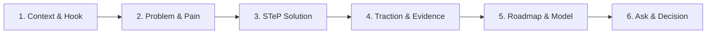

# STeP Presentation & Pitch Deck Engine

## Purpose

ช่วยบุคลากร STeP และผู้ประกอบการวางสตอรี่ไลน์และสร้างสไลด์นำเสนอระดับมืออาชีพเป็น **Interactive 16:9 HTML Presentation** ที่เปิดบนเบราว์เซอร์ได้ทันทีโดยไม่ต้องพึ่งโปรแกรมภายนอก รองรับการแปลงจาก PowerPoint และส่งออกเป็น PDF

## เมื่อควรใช้

ใช้เมื่อผู้ใช้พูดในลักษณะ:
- "ช่วยทำสไลด์ Pitching"
- "ขอสไลด์สรุปโครงการเสนอผู้บริหาร"
- "แปลงไฟล์ PPT เป็นเว็บ"
- "ปรับสไลด์ HTML เดิมให้เนื้อหาไม่ล้น"

**Anti-trigger:**
- ต้องการเนื้อหาสารและข้อมูล ไม่ใช่รูปแบบสไลด์ ให้ใช้ Skill ของงานนั้นก่อน เช่น `executive-status-update` หรือ `project-plan`
- ต้องการบรีฟงานออกแบบให้ดีไซเนอร์ ให้ใช้ `designer-brief`
- ต้องการตรวจการใช้อัตลักษณ์องค์กร ให้ใช้ `step-brand`

## Inputs

ขั้นต่ำ:
- หัวข้อและวัตถุประสงค์การนำเสนอ
- ผู้ฟังและเวลาที่ใช้

ช่วยให้งานเร็วขึ้นถ้ามี:
- เนื้อหาหรือตัวเลขที่ยืนยันแล้ว
- ไฟล์ `.pptx` เดิม หรือไฟล์ HTML ที่ต้องการปรับ

ถ้าเนื้อหายังไม่ครบ ให้ยกร่างโครงเรื่องก่อน และติดป้าย `[รอยืนยัน]` ทุกจุดที่ยังไม่มีข้อมูลจริง

## Source

- เนื้อหาสาระมาจาก **ข้อมูลที่ผู้ใช้ให้มา** เท่านั้น
- อัตลักษณ์องค์กรอ้างอิง `step-brand` และ [CI manual digest reference](../../common/step-brand/references/ci-manual-digest.md); `templates/style-presets.md` เป็นตัวเลือกออกแบบ ไม่ใช่ข้อกำหนด CI ทั้งหมด
- แม่แบบและสคริปต์: `templates/presentation-master-template.html`, `templates/viewport-base.css`, `templates/style-presets.md`, `templates/animation-patterns.md`, `scripts/extract-pptx.py`, `scripts/export-pdf.js`, `scripts/export-pdf.bat`, `scripts/export-pdf.sh`

## Workflow

**Phase 0 — ตรวจจับโหมดงาน**
- Mode A สร้างใหม่ → ไป Phase 1
- Mode B แปลงไฟล์ `.pptx` → ไป Phase 4
- Mode C ปรับสไลด์ HTML เดิม → รักษาขนาด 1920x1080 ตรวจเนื้อหาล้นการ์ด แล้วจัดสัดส่วนใหม่

**Phase 1 — เป้าหมายและโครงเรื่อง**

ถามคำถามนำทาง 4 ข้อในคราวเดียว: วัตถุประสงค์ (Pitch ขอทุน / Executive Proposal / Project Showcase / Workshop), ความยาว (5-7, 8-15 หรือ 16-25 สไลด์), สถานะเนื้อหา และโหมดความหนาแน่น

โครงเรื่องมาตรฐาน (STeP Pitching Story Arc):



**Phase 2 — แสดงตัวอย่างสไตล์จริง**

สร้าง Title Slide Preview เป็นไฟล์ HTML แยก 3 สไตล์ให้คลิกดูจริง: Style A STeP Signature Innovation, Style B Executive Slate & Silver, Style C Creative Voltage

สไลด์ตัวอย่างต้องใช้ข้อความจริงของผู้ใช้ ห้ามพิมพ์คำว่า "Style A", "Option 1", "Draft" หรือ "AI Generated" ลงบนสไลด์ ให้ระบุชื่อสไตล์ในข้อความแชตเท่านั้น

**Phase 3 — สร้างสไลด์ฉบับสมบูรณ์**

ดึงรูปแบบจาก `templates/presentation-master-template.html` แล้วประกอบ: ฝัง CSS 16:9 จาก `templates/viewport-base.css`, ผสานสีและฟอนต์จาก `templates/style-presets.md`, ใส่แอนิเมชันจาก `templates/animation-patterns.md` ด้วยคลาส `.reveal` แบบ staggered, ระบบนำทางครบ (ปุ่มจอ คีย์บอร์ด ปัดนิ้ว โหมดเต็มจอ `F` และ Speaker Notes `N`) และ In-Browser Inline Text Editor

**Phase 4 — แปลงไฟล์ PowerPoint**

```bash
python skills/creative/presentation-design/scripts/extract-pptx.py input.pptx output_dir/
```

สคริปต์สร้าง `extracted-slides.json` และแยกรูปลง `assets/` จากนั้นสรุปโครงสร้างหัวข้อให้ผู้ใช้ตรวจ แล้วทำต่อตาม Phase 2-3

**Phase 5 — ส่งมอบและแก้ไขสด**

แจ้งวิธีใช้: ดับเบิลคลิกเปิดไฟล์ `.html`, เลื่อนสไลด์ด้วยลูกศรหรือ Spacebar, `F` เต็มจอ, `N` Speaker Notes, `E` เปิดโหมดแก้ไขข้อความบนสไลด์ แล้วกดบันทึกเพื่อดาวน์โหลดไฟล์เวอร์ชันล่าสุด

**Phase 6 — ส่งออกและเผยแพร่**

```bash
bash skills/creative/presentation-design/scripts/export-pdf.sh presentation.html
```

บน Windows ใช้ `scripts\export-pdf.bat` หรือรัน `node scripts/export-pdf.js` โดยตรง ทางเลือกสำรองคือพิมพ์ผ่านเบราว์เซอร์ เลือก Save as PDF แนวนอน และเปิด Background graphics

## Output

- ไฟล์ HTML เดี่ยวที่เปิดแบบ offline ได้ พร้อมระบบนำทาง Speaker Notes และ Inline Editor
- ถ้าเป็น Phase 2 จะได้ไฟล์ตัวอย่าง 3 สไตล์ก่อนตัดสินใจ
- PDF 1920x1080 แนวนอน เมื่อผู้ใช้ขอส่งออก
- รายการข้อมูลที่ยังไม่ยืนยัน ติดป้าย `[รอยืนยัน]` แยกให้เจ้าของงานตรวจ

## Authority

AI ช่วยได้: วางโครงเรื่อง ออกแบบสไลด์ แปลงไฟล์ และส่งออก

ต้องให้มนุษย์ตัดสิน:
- การรับรองตัวเลข สถิติ ผลทดสอบ รางวัล หรือชื่อผู้รับรองที่ปรากฏบนสไลด์
- การเผยแพร่สไลด์สู่ภายนอกองค์กร
- การดัดแปลงโลโก้หรืออัตลักษณ์องค์กร — `brand-alteration` ใน `manifest/authority.yaml`

## Handoff

- เนื้อหาที่ต้องตรวจก่อนนำเสนอ ส่งต่อเจ้าของข้อมูลหรือ `document-review`
- ประเด็นการใช้อัตลักษณ์องค์กร ส่งต่อ `step-brand` หรือทีม CC
- ตัวเลขการเงินและงบประมาณ ส่งต่อ AFP ยืนยันก่อนขึ้นสไลด์

พร้อมส่งต่อเมื่อ: ทุกตัวเลขบนสไลด์มีแหล่งอ้างอิง และไม่มี `[รอยืนยัน]` ค้างในเวอร์ชันที่จะนำเสนอจริง

## Guardrails

1. **Fixed 16:9 Stage (1920x1080)** — ทุกสไลด์อยู่บนพื้นที่คงที่ในคอนเทนเนอร์ `.deck-stage` สเกลด้วย CSS Transform (`translate` + `scale`) ห้ามใช้ CSS Breakpoint หรือ reflow จนเสียทรง และควบคุมการแสดงผลด้วยคลาส `.active` / `.visible` คู่กับ `visibility`, `opacity`, `pointer-events` ไม่ใช้ `display: none / block`
2. **Zero-Dependency Single File** — ผลลัพธ์ต้องเป็น HTML เดี่ยวที่บรรจุ CSS, JS และเนื้อหาครบ เปิด offline ได้
3. **Brand CI** — ใช้สีและ logo rules จาก CI manual digest reference พร้อมคำยืนยันผู้ใช้; แยกสถานะสีดิจิทัลออกจากสีพิมพ์และฉบับควบคุม ใช้ official logo asset ตามพื้นหลังและขนาดปลายทาง ส่วน SIMPLE (เป้าหมายพื้นที่ว่าง 30%), SERVICE, SINCERE เป็นแนวทางออกแบบ ไม่ใช่ข้อกำหนดใน digest
4. **Typography ภาษาไทย** — ค่าเริ่มต้นงานนำเสนอเลือก Prompt, Kanit, Sarabun หรือ IBM Plex Sans Thai ตามความอ่านง่าย; digest ไม่ได้ระบุฟอนต์องค์กรหรือห้าม Arial, Times New Roman, Tahoma
5. **No Fabricated Metrics** — ห้ามกุตัวเลข สถิติ ผลทดสอบ รางวัล หรือชื่อผู้รับรอง ข้อมูลที่ยังไม่ยืนยันให้ใส่ `[รอยืนยัน]` หรือระบุว่าเป็นสมมติฐาน
6. **Content Density** — เลือกโหมดให้ตรงบริบท: Low Density สำหรับบรรยายสด (1 สไลด์ 1 ประเด็น หัวข้อใหญ่ 60-84px ไม่เกิน 3 บุลเล็ต) และ High Density สำหรับอ่านเอง (การ์ด 3-4 คอลัมน์ ตาราง แผนภูมิ บุลเล็ต 4-6 ข้อมีลำดับชั้น)
