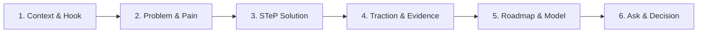

# STeP Presentation & Pitch Deck Engine (ทักษะออกแบบและสร้างสไลด์นำเสนอ)

ทักษะนี้ใช้สำหรับช่วยบุคลากรทุกแผนกของ **อุทยานวิทยาศาสตร์และเทคโนโลยี มหาวิทยาลัยเชียงใหม่ (STeP / RSP North)** และผู้ประกอบการในการวางโครงสร้าง สตอรี่ไลน์ และสร้างไฟล์สไลด์นำเสนอระดับมืออาชีพในรูปแบบ **Interactive 16:9 HTML Presentation** ที่เปิดทำงานบนเว็บเบราว์เซอร์ได้ทันทีโดยไม่ต้องพึ่งพาโปรแกรมภายนอก พร้อมรองรับการแปลงไฟล์จาก PowerPoint (`.pptx`) และส่งออกเป็นเอกสาร PDF คมชัดสูง

---

## 🎨 กฎเหล็กด้านอัตลักษณ์องค์กรและสถาปัตยกรรมสไลด์ (Core Invariants)

ทุกชุดสไลด์ที่สร้างขึ้นต้องยึดถือมาตรฐานสำคัญ 5 ประการต่อไปนี้อย่างเคร่งครัด:

1. **Fixed 16:9 Stage Architecture (1920×1080 px) — กฎเหล็กห้ามละเมิด:**
   - สไลด์ทุกหน้าต้องถูกสร้างบนพื้นที่ขนาดคงที่ **1920×1080 พิกเซล** ภายในคอนเทนเนอร์ `.deck-stage`
   - ระบบ JavaScript จะทำการสเกลทั้ง Stage ด้วย CSS Transform (`translate` + `scale`) ให้พอดีกับหน้าจอของผู้ใช้งานเสมอ (Letterbox/Pillarbox ได้ แต่**ห้ามใช้ CSS Breakpoint หรือ Reflow จัดเลย์เอาต์ใหม่จนเสียทรงบนจอมือถือ**)
   - การควบคุมการแสดงผลของสไลด์ต้องใช้คลาส `.active` และ `.visible` ควบคู่กับ `visibility`, `opacity`, และ `pointer-events` (ห้ามใช้ `display: none / block` เพราะอาจชนกับ Layout Grid)
2. **Zero-Dependency Single-File Presentation:**
   - ผลลัพธ์ต้องเป็นไฟล์ HTML เดี่ยวที่บรรจุ CSS, JavaScript, และโครงสร้างเนื้อหาไว้ครบถ้วนในตัว สามารถดับเบิลคลิกเปิดบนเบราว์เซอร์ใดก็ได้แบบ Offline
3. **อัตลักษณ์สีและแบรนด์ STeP (Brand CI):**
   - **STeP Innovation Yellow:** `#F9AE3B` / `#F2A32D` (สีเหลืองอำพันนวัตกรรม สดใส อบอุ่น มีพลัง เป็นสีนำสายตา)
   - **Corporate Slate Charcoal:** `#2B333D` (สีตัวหนังสือ กรอบโครงสร้าง และพื้นหลังดาร์กโหมด สุขุม น่าเชื่อถือ)
   - **Crisp Pure White:** `#FFFFFF` และ **Off-White:** `#FAF9F6` (สำหรับพื้นหลังและการ์ดเนื้อหา)
   - **ค่านิยมหลัก:** **SIMPLE** (เรียบง่าย สบายตา พื้นที่ว่าง $\ge 30\%$), **SERVICE** (ใส่ใจผู้ฟัง มุ่งเน้นประโยชน์), **SINCERE** (ซื่อตรง จริงใจ ข้อมูลมีหลักฐานยืนยัน)
4. **แบบอักษรภาษาไทยคุณภาพสูง (Typography):**
   - ห้ามใช้ฟอนต์ดีฟอลต์ของระบบ (Arial, Times New Roman, Tahoma)
   - ใช้แบบอักษร Google Fonts สำหรับภาษาไทย: **Prompt** (แนะนำสำหรับ Pitch Deck / ทันสมัย), **Kanit** (สไตล์สวิสมินิมอล), **Sarabun** (สไตล์ทางการ/บอร์ดบริหาร), หรือ **IBM Plex Sans Thai** (สไตล์วิชาการ/นิตยสาร)
5. **ความถูกต้องของข้อมูล (No Fabricated Metrics):**
   - **ห้ามกุตัวเลข สถิติ ผลการทดสอบ รางวัล หรือชื่อผู้รับรองขึ้นมาเองโดยไม่มีหลักฐาน** (ตามกฎ Human-Only Boundary) หากข้อมูลส่วนใดยังไม่ยืนยัน ให้ใส่เครื่องหมาย `[รอยืนยัน]` หรือระบุเป็นสมมติฐานอย่างโปร่งใส

---

## 📊 โหมดความหนาแน่นของเนื้อหา (Content Density Modes)

สอบถามหรือประเมินบริบทของผู้ใช้งานเพื่อเลือกโหมดความหนาแน่นที่เหมาะสม:

| โหมดความหนาแน่น | บริบทการใช้งาน | แนวทางการออกแบบ |
|---|---|---|
| **Low Density (Speaker-led)** | บรรยายสดบนเวที, Pitching แข่งขัน, สปีชผู้บริหาร (Keynote) | **1 สไลด์ 1 ประเด็นหลัก**, หัวข้อกระชับ ตัวอักษรขนาดใหญ่ (Hero Title 60-84px), สัญลักษณ์และภาพชัดเจน, ไม่เกิน 1-3 บุลเล็ต, มีพื้นที่หายใจกว้างขวาง |
| **High Density (Reading-first)** | รายงานเสนอผู้บริหาร, เอกสารแนบการประชุม, สไลด์สรุปส่งต่อให้อ่านเอง (Async Deck) | สไลด์สรุปข้อมูลครบถ้วนในตัวเอง, ใช้การ์ด 3-4 คอลัมน์, ตารางเปรียบเทียบ, แผนภูมิและตัวเลขสถิติ, บุลเล็ตอธิบาย 4-6 ข้อที่มีลำดับชั้นชัดเจน |

---

## 🧙‍♂️ ขั้นตอนการทำงานแบบ 6-Phase Guided Workflow

เมื่อผู้ใช้งานเรียกใช้ทักษะนี้ (เช่น *"ช่วยทำสไลด์ Pitching..."*, *"ขอสไลด์สรุปโครงการ..."*, หรือ *"แปลงไฟล์ PPT เป็นเว็บ..."*) ให้ดำเนินงานตามลำดับขั้นตอนดังนี้:

---

### Phase 0: ตรวจจับโหมดงาน (Detect Mode)
จำแนกความต้องการออกเป็น 3 โหมด:
- **Mode A: New Presentation (สร้างใหม่):** เริ่มต้นตั้งแต่การวาง Story Arc และค้นหาไอเดีย (ไป Phase 1)
- **Mode B: PPT Conversion (แปลงไฟล์ PowerPoint):** มีไฟล์ `.pptx` เดิมอยู่แล้วและต้องการแปลงเป็น Modern Web Deck (ไป Phase 4)
- **Mode C: Enhancement (ปรับปรุงสไลด์ HTML เดิม):** ตรวจสอบไฟล์ HTML เดิม รักษาขนาด 1920×1080 ตรวจสอบว่าเนื้อหาไม่ล้นกล่องการ์ด และจัดสัดส่วนใหม่

---

### Phase 1: ค้นหาเป้าหมายและโครงสร้างเนื้อหา (Content & Story Arc)
หากเป็นสไลด์สร้างใหม่ (Mode A) ให้ถามคำถามนำทาง 4 ข้อสั้นๆ ในคราวเดียว:

1. **วัตถุประสงค์ของการนำเสนอ (Purpose):**
   - `[1]` Pitch Deck ขอรับทุน / แข่งขันสตาร์ทอัพ
   - `[2]` Executive Proposal นำเสนอผู้บริหาร / ขออนุมัติงบประมาณ
   - `[3]` Project Showcase รายงานผลสัมฤทธิ์โครงการ
   - `[4]` Workshop & Training สไลด์อบรม / สัมมนาเชิงลึก
2. **ความยาวและเวลาที่ใช้ (Length & Time):**
   - สั้นกระชับ (5-7 สไลด์, 3-5 นาที)
   - มาตรฐาน (8-15 สไลด์, 10-15 นาที)
   - ละเอียดครบถ้วน (16-25 สไลด์, สำหรับอ่านประกอบ)
3. **สถานะข้อมูลที่มี (Content Status):**
   - มีเนื้อหาและตัวเลขครบแล้ว
   - มีเพียงประเด็นย่อหรือหัวข้อคร่าวๆ
   - ยังไม่มีเนื้อหา ต้องการให้ช่วยยกร่างโครงเรื่อง
4. **สไตล์การนำเสนอ (Density Mode):**
   - Low Density (เน้นพูดสด สไลด์สะอาดตา ตัวหนังสือใหญ่)
   - High Density (เน้นอ่านละเอียด มีการ์ดและตารางครบถ้วน)

#### โครงสร้างการเล่าเรื่องมาตรฐาน (STeP Pitching Story Arc):

1. **Hook & Context:** แนะนำชื่อโครงการและผลกระทบเชิงบวกต่อสังคม/เศรษฐกิจ
2. **Problem & Pain Points:** ระบุปัญหาที่เกิดขึ้นจริงและคอขวดที่ผู้เกี่ยวข้องเผชิญ
3. **STeP Solution & Mechanism:** แนวทางแก้ไข นวัตกรรม เทคโนโลยี หรือบริการของ STeP ที่ตอบโจทย์
4. **Evidence & Traction:** ผลงานเชิงประจักษ์ สถิติที่ตรวจสอบได้ และเสียงตอบรับจากกลุ่มเป้าหมาย
5. **Roadmap & Resources:** แผนงานงวด Milestone ทีมงาน และทรัพยากรที่จำเป็น
6. **Call to Action / Decision Required:** สิ่งที่ต้องการให้ที่ประชุมหรือกรรมการอนุมัติอย่างชัดเจน

---

### Phase 2: แสดงตัวอย่างสไตล์จริง (Show, Don't Tell Style Discovery)
**ห้ามถามผู้ใช้ว่าชอบสีอะไรเป็นข้อความนามธรรม** แต่ให้สร้างตัวอย่างสไลด์หน้าแรก (Title Slide Preview) เป็นไฟล์ HTML แยก 3 สไตล์ให้ผู้ใช้คลิกดูความรู้สึกจริง:

- **Style A: STeP Signature Innovation** — โทนเหลือง STeP Yellow (`#F9AE3B`) + ชาร์โคล (`#2B333D`) สะท้อนอัตลักษณ์องค์กร
- **Style B: Executive Slate & Silver** — โทนดาร์กสเลทหรูหรา น่าเชื่อถือ เหมาะกับการตัดสินใจเชิงนโยบาย
- **Style C: Creative Voltage / Startup Pitch** — โทนพลังงานสูง คอนทราสต์จัดจ้าน เร้าใจสำหรับเวทีแข่งขัน

> [!IMPORTANT]
> **กฎความสมจริงของสไลด์ตัวอย่าง (Authenticity Rule):**
> สไลด์ตัวอย่างต้องใช้ข้อความจริงจากหัวข้อของผู้ใช้ เสมือนเป็นสไลด์หน้าแรกจริงๆ **ห้ามพิมพ์ข้อความกระบวนการทำงาน เช่น "Style A", "Option 1", "Draft", หรือ "AI Generated" ลงบนตัวสไลด์เด็ดขาด** (ให้ระบุชื่อสไตล์ในข้อความแชตเท่านั้น)

---

### Phase 3: สร้างสไลด์นำเสนอฉบับสมบูรณ์ (Generate Full Presentation)
เมื่อผู้ใช้เลือกสไตล์แล้ว ให้สร้างไฟล์ HTML สมบูรณ์ (เช่น `presentation.html`) โดยดึงรูปแบบจาก [presentation-master-template.html](templates/presentation-master-template.html) และประกอบด้วยองค์ประกอบครบถ้วน:

1. **ฝัง CSS 16:9 Fixed Canvas** จาก [viewport-base.css](templates/viewport-base.css)
2. **ผสานชุดสีและฟอนต์** จาก [style-presets.md](templates/style-presets.md)
3. **เพิ่มเอฟเฟกต์แอนิเมชัน** จาก [animation-patterns.md](templates/animation-patterns.md) ด้วยคลาส `.reveal` พร้อมการหน่วงเวลาแบบ Staggered delay
4. **ระบบการนำทางครบถ้วน:** ปุ่มกดหน้าจอ, คีย์บอร์ด (ลูกศรซ้าย/ขวา, Space, PageUp/Down), การปัดนิ้วบนทัชสกรีน (Touch Swipe), โหมดเต็มจอ (`F`), และ Speaker Notes Drawer (`N`)
5. **ฝัง In-Browser Inline Text Editor** เพื่อให้ผู้ใช้กดแก้ข้อความบนหน้าจอได้ทันที

---

### Phase 4: การแปลงไฟล์ PowerPoint (PPTX Conversion)
กรณีผู้ใช้ส่งไฟล์ PowerPoint (`.pptx`) มาให้:
1. รันสคริปต์สกัดข้อมูล:
   ```bash
   python skills/creative/presentation-design/scripts/extract-pptx.py input.pptx output_dir/
   ```
2. สคริปต์จะสร้างไฟล์ `extracted-slides.json` และแยกรูปภาพทั้งหมดลงในโฟลเดอร์ `assets/`
3. สรุปโครงสร้างหัวข้อและจำนวนรูปให้ผู้ใช้ตรวจสอบ
4. ดำเนินการสร้างสไลด์ HTML ตาม Phase 2 และ 3 โดยอ้างอิงรูปภาพจาก `assets/slideX_imgY.png`

---

### Phase 5: การส่งมอบและการแก้ไขสด (Delivery & Inline Editing)
เมื่อส่งมอบไฟล์สไลด์ ให้แจ้งคำแนะนำแก่ผู้ใช้งาน:
- **การเปิดดู:** ดับเบิลคลิกไฟล์ `.html` เพื่อเปิดบน Chrome, Edge, Safari หรือเบราว์เซอร์ใดก็ได้
- **การควบคุมการนำเสนอ:**
  - `◀` / `▶` หรือ `Spacebar`: เลื่อนสไลด์
  - `F`: สลับโหมดเต็มจอ (Fullscreen Presentation)
  - `N`: เปิด/ปิดหน้าต่างบันทึกผู้บรรยาย (Speaker Notes)
- **โหมดแก้ไขข้อความสด (In-Browser Inline Editor):**
  - **กดปุ่ม `E`** บนแป้นพิมพ์ หรือเลื่อนเมาส์ไปที่มุมซ้ายบนของหน้าจอแล้วคลิกปุ่ม **✏️ แก้ไขเนื้อหา**
  - คลิกที่ข้อความใดก็ได้บนสไลด์เพื่อพิมพ์แก้ไขข้อความโดยตรง
  - กดปุ่ม **💾 บันทึกไฟล์ HTML** เพื่อดาวน์โหลดไฟล์สไลด์เวอร์ชันล่าสุดที่แก้ไขแล้วทันที

---

### Phase 6: การส่งออกและการเผยแพร่ (Export & Sharing)
หากผู้ใช้ต้องการส่งออกไฟล์หรือแชร์:
1. **ส่งออกเป็น PDF คุณภาพสูง (1920×1080 Landscape):**
   - **บน Windows:**
     ```cmd
     skills\creative\presentation-design\scripts\export-pdf.bat presentation.html
     ```
   - **บน macOS / Linux:**
     ```bash
     bash skills/creative/presentation-design/scripts/export-pdf.sh presentation.html
     ```
   - หรือรันผ่าน Node.js โดยตรง:
     ```bash
     node skills/creative/presentation-design/scripts/export-pdf.js presentation.html
     ```
2. **พิมพ์ทางเบราว์เซอร์โดยตรง:** กด `Ctrl + P` (หรือ `Cmd + P`) -> เลือกปลายทางเป็น "Save as PDF" -> เลือกขนาดกระดาษแนวนอน (Landscape) และเปิดตัวเลือก "Background graphics"

---

## 📚 รายการเอกสารและเครื่องมือสนับสนุน (Supporting Assets)

| ไฟล์ทรัพยากร | วัตถุประสงค์การใช้งาน | ตำแหน่งไฟล์ |
|---|---|---|
| [viewport-base.css](templates/viewport-base.css) | กฎ CSS บังคับสำหรับล็อก Stage 16:9 (1920×1080) และระบบ Print | `templates/viewport-base.css` |
| [presentation-master-template.html](templates/presentation-master-template.html) | โค้ดแม่แบบสไลด์ HTML ฉบับสมบูรณ์พร้อม Controller และ Inline Editor | `templates/presentation-master-template.html` |
| [style-presets.md](templates/style-presets.md) | คลังชุดสีและ Typography ตาม STeP Brand CI และสากล | `templates/style-presets.md` |
| [animation-patterns.md](templates/animation-patterns.md) | รูปแบบแอนิเมชัน การโผล่ขึ้น และการตอบสนองเมาส์ | `templates/animation-patterns.md` |
| [extract-pptx.py](scripts/extract-pptx.py) | สคริปต์ Python แยกข้อความ สไลด์ และรูปภาพจากไฟล์ `.pptx` | `scripts/extract-pptx.py` |
| [export-pdf.js](scripts/export-pdf.js) | สคริปต์ Node.js ส่งออกสไลด์ HTML เป็น PDF 1080p | `scripts/export-pdf.js` |
| [export-pdf.bat](scripts/export-pdf.bat) | แบทช์ไฟล์อำนวยความสะดวกสำหรับผู้ใช้งาน Windows | `scripts/export-pdf.bat` |
| [export-pdf.sh](scripts/export-pdf.sh) | เชลล์สคริปต์อำนวยความสะดวกสำหรับผู้ใช้งาน macOS/Linux | `scripts/export-pdf.sh` |
