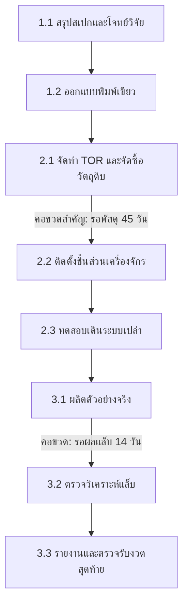

# แม่แบบแผนงานโครงการและงวดงาน STeP (Project Plan & WBS Template)

**รหัสโครงการ:** [เช่น STeP-INN-2569-001]  
**ชื่อโครงการ:** [ชื่อโครงการเต็มภาษาไทยและภาษาอังกฤษ]  
**หน่วยงาน/ทีมรับผิดชอบหลัก:** [เช่น PM, PubSec, Tech Up]  
**หัวหน้าโครงการ (Project Owner):** [ชื่อ-นามสกุล / ตำแหน่ง]  
**ระยะเวลาดำเนินงาน:** [วันเริ่มต้น - วันสิ้นสุด] (รวมทั้งสิ้น [X] เดือน)  
**งบประมาณรวม:** [ตัวเลขงบประมาณที่ได้รับอนุมัติ] บาท  

---

## 1. วัตถุประสงค์และขอบเขตงาน (Scope & Objectives)

### 1.1 วัตถุประสงค์โครงการ
1. [วัตถุประสงค์ข้อที่ 1 ที่ชัดเจน วัดผลได้]
2. [วัตถุประสงค์ข้อที่ 2]

### 1.2 สิ่งที่ส่งมอบหลัก (Key Deliverables)
- [Deliverable 1: เช่น ต้นแบบผลิตภัณฑ์ระดับกึ่งอุตสาหกรรม พร้อมรายงานผลการทดสอบ]
- [Deliverable 2: เช่น คู่มือขั้นตอนการปฏิบัติงานมาตรฐานและแบบแปลนระบบ]

### 1.3 สิ่งที่ไม่รวมอยู่ในโครงการ (Out of Scope)
- [ระบุงานที่ไม่รวมอย่างชัดเจนเพื่อป้องกัน Scope Creep เช่น การขยายโรงงานเชิงพาณิชย์ หรือการโฆษณาทำการตลาดหลังส่งมอบ]

---

## 2. โครงสร้างการแตกงานและงวดงาน (Work Breakdown Structure & Milestones)

| งวดงาน (Milestone) | กิจกรรมย่อย (WBS) | ผลผลิตที่ต้องส่งมอบ (Deliverable) | เกณฑ์การตรวจรับ (Acceptance Criteria) | ผู้รับผิดชอบหลัก | กำหนดส่ง (Deadline) |
|---|---|---|---|---|:---:|
| **งวดที่ 1: การเตรียมการและออกแบบ** | 1.1 สำรวจข้อกำหนดและสเปก 1.2 จัดทำแบบพิมพ์เขียวทางวิศวกรรม 1.3 ประสานขอใช้โรงงานต้นแบบ | • เอกสารรายงานสเปก • แบบแปลน CAD/Engineering Layout | • ผ่านการรับรองโดยวิศวกรผู้เชี่ยวชาญ • ลงนามรับรองโดยหัวหน้าโครงการ | [ชื่อเจ้าของงาน] | M + 2 เดือน |
| **งวดที่ 2: การจัดซื้อพัสดุและติดตั้ง** | 2.1 จัดทำร่าง TOR จัดซื้อวัตถุดิบ 2.2 ตรวจสอบพัสดุและติดตั้งชิ้นส่วน 2.3 ทดสอบระบบเปล่า (Dry Run) | • ใบตรวจรับพัสดุทางการ • บันทึกการทดสอบเดินเครื่องเปล่า | • อุปกรณ์ตรงตาม TOR ครบถ้วน • ไม่มี Error ร้ายแรงในการทดสอบ 48 ชม. | [ชื่อเจ้าของงาน] | M + 5 เดือน |
| **งวดที่ 3: การทดลองผลิตและตรวจวิเคราะห์** | 3.1 ทดลองผลิตชุดตัวอย่างจริง 3.2 ส่งตรวจวิเคราะห์แล็บ LES 3.3 รวบรวมข้อมูล TRL และสรุปผล | • ผลิตภัณฑ์ตัวอย่าง 50 ชุด • รายงานผลวิเคราะห์จากห้องแล็บ • รายงานฉบับสมบูรณ์ | • ค่ามาตรฐานทางเคมี/จุลชีวะผ่านเกณฑ์ • คณะกรรมการตรวจรับลงนามอนุมัติ | [ชื่อเจ้าของงาน] | M + 8 เดือน |

*หมายเหตุ: วันที่ส่งมอบจริงให้นับย้อนจากวันที่ต้องใช้งานจริง โดยรวมเวลาตรวจแก้เอกสาร การจัดซื้อพัสดุ และการขนส่งแล้วอย่างน้อย 15-30 วัน*

---

## 3. เส้นทางวิกฤตและความขึ้นต่อกันของงาน (Critical Path & Dependencies)

### รายการจุดเชื่อมโยงข้ามฝ่าย (Cross-Team Dependencies):
1. **จัดซื้อพัสดุ (ส่งต่อทีม AFP):** ต้องส่งเอกสาร TOR ก่อนเริ่มงวดอย่างน้อย 30 วันทำการ
2. **การตรวจวิเคราะห์ (ส่งต่อทีม LES):** ต้องจองคิวเครื่องมือวิเคราะห์ล่วงหน้าอย่างน้อย 14 วัน
3. **การส่งออกเอกสารสารบรรณ (ส่งต่อทีม GA):** เผื่อเวลาเดินหนังสือราชการ 3-5 วันทำการ

---

## 4. ตารางบันทึกการบริหารความเสี่ยง (Risk Register)

| ลำดับ | รายการความเสี่ยง | โอกาสเกิด (P) | ผลกระทบ (I) | ระดับ | สัญญาณเตือน (Trigger) | แผนป้องกัน / แผนรับมือ (Mitigation) | ผู้รับผิดชอบ |
|:---:|---|:---:|:---:|:---:|---|---|---|
| R1 | วัตถุดิบนำเข้าล่าช้ากว่ากำหนด | กลาง (3) | สูง (4) | 12 (สูง) | ผู้จำหน่ายไม่ยืนยัน Tracking ภายใน 14 วัน | สั่งซื้อล่วงหน้า และเตรียมซัพพลายเออร์สำรองในประเทศ | [ชื่อเจ้าของงาน] |
| R2 | ผลวิเคราะห์แล็บไม่ผ่านเกณฑ์มาตรฐาน | ต่ำ (2) | สูง (5) | 10 (กลาง) | ผลการตรวจรอบพรีสกรีนมีค่าเบี่ยงเบน | วางแผนเผื่อรอบทดลองผลิตสำรอง 2 แบทช์ | [ชื่อเจ้าของงาน] |
| R3 | บุคลากรวิจัยติดภารกิจการสอน | สูง (4) | กลาง (3) | 12 (สูง) | ขาดการเข้าร่วมประชุมติดตามงาน 2 ครั้งติด | มอบหมายผู้ช่วยวิจัยสำรองเป็นผู้ประสานงานหลัก | [ชื่อเจ้าของงาน] |

---

## 5. จุดตัดสินใจและคณะกรรมการกำกับ (Governance & DACI Matrix)

| ประเด็นการตัดสินใจ (Decision Gate) | ผู้ขับเคลื่อน (Driver) | ผู้อนุมัติ (Approver) | ผู้ให้ข้อมูล (Contributors) | ผู้รับแจ้งทราบ (Informed) |
|---|---|---|---|---|
| **Gate 1: อนุมัติแบบพิมพ์เขียว** | หัวหน้าโครงการ | ผู้อำนวยการฝ่ายวิศวกรรม | ผู้เชี่ยวชาญเทคนิค, ทีม PM | ทีมวิจัยทั้งหมด |
| **Gate 2: ตรวจรับพัสดุและครุภัณฑ์** | เจ้าหน้าที่พัสดุ | คณะกรรมการตรวจรับพัสดุ | ผู้จำหน่าย, นักวิจัย | ทีม AFP, ทีม PM |
| **Gate 3: ตรวจรับงานงวดสุดท้ายและปิดโครงการ** | หัวหน้าโครงการ | คณะกรรมการตรวจรับของแหล่งทุน | ทีมวิจัย, ทีมบัญชี | ผู้มีส่วนได้ส่วนเสียทั้งหมด |

*หมายเหตุ: ตามระเบียบมหาวิทยาลัยและ STeP Authority Matrix การตัดสินใจในช่อง Approver ต้องกระทำโดยบุคลากรผู้มีอำนาจลงนามเท่านั้น (Human Approval Mandatory)*
